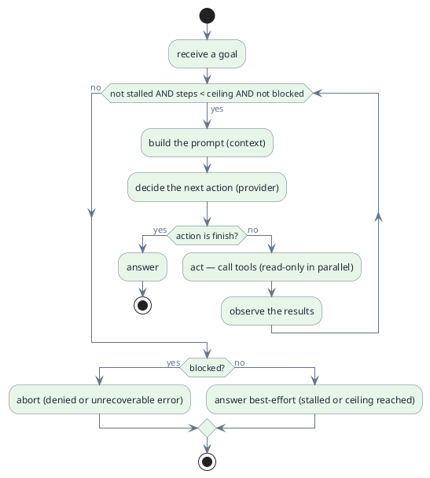
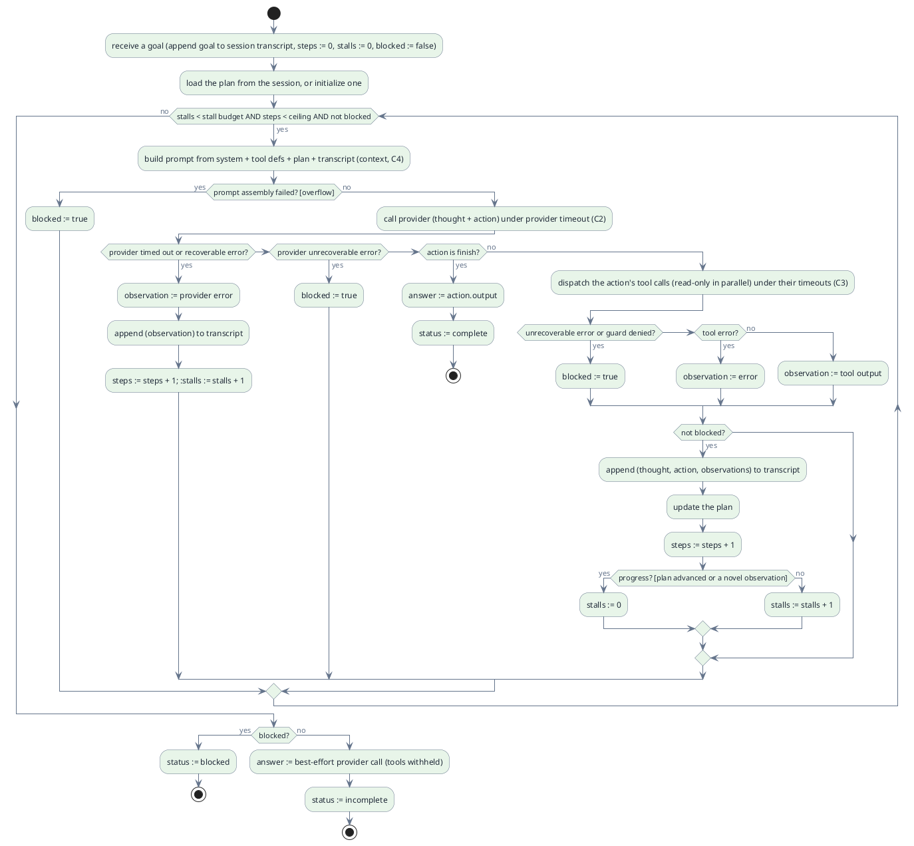

# C1 — Loop

> Status: draft · Version 0.6 · **Current tier: Prop**

Every agent, at its core, is one loop. Everything else is scope built
around that loop. `C1` is that core: the control cycle that turns a goal
into actions, observations, and finally an answer.

## Overview

A goal is one user request; a run is one execution of the loop over it.
The loop is what every tier shares — Prop, Pilot, and Orbit all run
the same cycle. The tiers differ only in how far each stage can go: a
plan-driven, streaming multi-step loop at Prop, with coding-scoped
self-correction, deepening into open-ended reflection and replanning at
Orbit. The diagram below is that shared, conceptual cycle;
the Prop section that follows gives the normative detail.

The model ends a run by choosing a `finish` action that produces the
answer. A recoverable error — a tool failure or a provider timeout —
surfaces as an observation and the loop re-iterates; a denial or an
unrecoverable error marks the run blocked. A run is bounded by *stalls*, not
by step count: consecutive steps that make no progress end it, while
productive steps continue. If the run stalls or hits the step ceiling first,
it makes one final provider call as a best-effort answer, under the model
timeout, marked incomplete — rather than aborting silently.

A run returns `{answer, status}`, where `status` is `complete`,
`incomplete`, or `blocked`; a blocked run may carry no answer. A clarifying
question counts as a finish; because the Prop session is continuous
(`sessions`, C5), the user's reply is appended to the same transcript and
the next run continues from it.

## Prop

Prop's loop is a plan-driven multi-step ReAct cycle: plan, reason, act,
observe, repeat. It is the minimum required to do real work on a codebase —
enough to read a file, make an edit, run a command, look at the result, and
carry the work across goals in a session — and no more. The detailed design
below is normative.

- **Plan-driven.** The loop keeps an explicit plan (a small ordered task
  list) in the session. It is loaded or initialized at the start of a run,
  updated after each observation, and shown by `interface` (C6) on demand.
  The plan, not the transcript alone, is what keeps long work on track.
- **Multi-step, bounded.** The loop iterates until `finish`, the run stalls,
  hits the step ceiling, or is blocked. `steps` increments once per provider
  decision — a step may carry several tool calls — and a high compiled-in
  ceiling bounds the total, so every run is guaranteed to terminate.
- **ReAct shape.** Each iteration emits a thought and an action; the action is
  either `finish` or one or more tool calls. A step's calls are dispatched
  together: independent read-only calls (`read`, `glob`, `search`, `diff`,
  `web_fetch`, `web_search`) run in parallel, while calls with side effects or
  order dependence (`write`, `edit`, `multi_edit`, `run_command`, `job`,
  `restore`) run sequentially in listed order. Each result returns as an
  observation bound to its call, and the thought, action, and observations are
  appended to the transcript as one turn.
- **Live progress.** When a human surface is attached, the loop forwards the
  streamed reply text and reports step, context use, tool calls, and
  observations as they happen, so the interface (C6) can render them live.
  It also measures and forwards how long each provider response and each tool
  dispatch took, plus the run total, as runtime-only timings (never part of
  the wire shape). Automation attaches nothing and takes the one-shot path,
  but the timings are still recorded for the interface to report.
- **Continuous sessions.** `transcript` and the plan belong to the session
  (`sessions`, C5), not to the run. A run appends to them and they persist
  across runs and invocations, so a later goal continues the work.
- **Coding-scoped correction.** Prop decides the *next* action and updates
  its plan, and may self-check and correct its output as coding requires;
  open-ended reflection and replanning over long horizons is Orbit.
- **Review and undo.** Within a run the loop may review its changes with
  `diff` and revert with `restore` (C3) before finishing, so self-correction
  is grounded in the actual workspace delta rather than in recollection.
- **Progress-driven guards.** A run is bounded by *stalls*, not by raw step
  count: it continues while steps make progress (a plan item newly completed,
  or an observation not seen before in the run) and ends after a compiled-in
  number of consecutive non-progress steps. A repeat of the same call with the
  same result, a recoverable error, or a timeout counts toward the stall
  budget, so a loop that keeps producing the same output is cut off while long
  productive work is not. A much larger compiled-in step ceiling remains only
  as a runaway safety net. Each provider or tool call runs under a timeout
  chosen by tool class (longer for `run_command`); a recoverable error becomes
  an observation and the loop re-iterates; an unrecoverable error or a guard
  denial marks the run blocked. A user cancel (`interface`, C6) ends the run
  and keeps the partial transcript. These guards are built in and not
  configurable at Prop — configurable policy is `safety` (C10).
- **Return contract.** A run returns the answer and a status of `complete`,
  `incomplete` (best-effort after a stall or the step ceiling), or `blocked`;
  consumers such as `interface` (C6) use the status.

At Prop the loop is what the builder uses to work on the codebase it is
generated from — including Prop itself. It must be reliable, terminating,
and resumable, because self-implementation runs through many goals in one
continuous session.

### Reserved: subagent nesting

Parallel exploration and context isolation are coding mechanisms Prop owns
(`C13` multi-agent, coding use). When the capability lands it nests inside
this loop under a fixed contract — reserved here, never stubbed: a subagent
is itself a loop (`C1`) running in a child session (`C5`) with its own
transcript (not written into the parent's session file), a stall budget and
step ceiling carved from the parent run's remaining budget, and the Prop
read-only tool set by default. It returns exactly one observation — its
final answer or failure — appended to the parent transcript, and it never
edits the parent plan.
