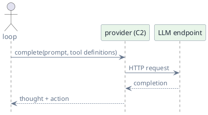
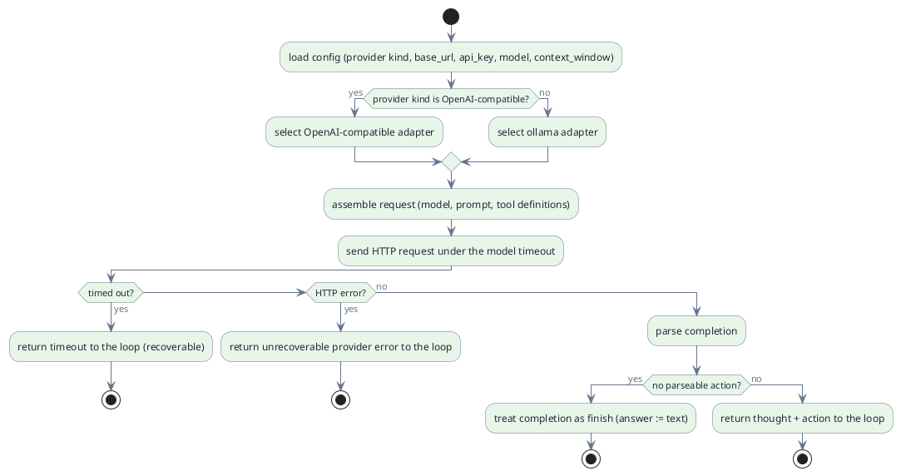

# C2 — Providers

> Status: draft · Version 0.5 · **Current tier: Prop**

The provider is the model behind the loop: `C2` is the single boundary
through which the agent reaches an LLM. The loop decides; the provider
turns a prompt into a thought and an action.

## Overview

A provider adapts the agent's request shape to one LLM API. Every tier
reaches models through this boundary, so the loop never knows which backend
is in use. The tiers differ in how many providers exist and how they are
selected: one at Prop, which may set the per-model parameters coding needs
(sampling, context); several with fallback and a model catalog at Pilot; and
a registry with OAuth at Orbit.



The provider is stateless with respect to the run: it receives a fully
assembled prompt (see `context`, C4) and returns the model's next output.
The loop (C1) calls it once per iteration; what to send and what to do with
the reply belongs to the loop, not here.

## Prop

Prop supports exactly one provider, selected from two adapters: an
OpenAI-compatible HTTP endpoint or ollama. The provider kind is an explicit
configuration value and never changes during a run; there is no fallback and
no model catalog. A timeout is returned to the loop as a recoverable
observation; an unrecoverable provider error is returned as such and blocks
the run (`reliability`, C8).



- **Single adapter.** The configured provider kind selects one of the two
  adapters; no other provider is reachable at Prop.
- **Stateless.** The provider holds no conversation state — the prompt is
  passed in full on every call.
- **Called once per iteration.** The loop (C1) invokes the provider for
  exactly one step's decision; the provider never loops on its own.
- **Multiple tool calls.** One completion may request several tool calls; the
  adapter normalizes them into a single action carrying a tool-call batch
  (`message` `action`), preserving the model's order. Independent read-only
  calls may then run in parallel (C1). Streaming merges each call's deltas by
  its index, so interleaved calls reassemble into the same batch.
- **Fixed model and window.** The configured model also fixes the context
  window size that `context` (C4) fits the prompt against.
- **Coding-scoped per-model parameters.** The context window and, where the
  adapter supports them, sampling parameters are part of Prop's model config;
  selecting among models, fallback, and OAuth are not.
- **No fallback.** There is one endpoint; a failure is returned rather than
  retried against another backend. A timeout is retried by the loop
  re-iterating, not by switching providers.
- **Malformed output.** A completion with no parseable action is treated as
  a `finish`, using the completion text as the answer (C1).
- **Streaming.** When the caller supplies a delta callback, the adapter
  requests a streamed completion (OpenAI `stream: true` over SSE; ollama
  `stream: true` over NDJSON), invokes it with each new chunk of *visible*
  text as it arrives, and assembles the full completion at the end. A second
  callback carries the *reasoning* stream (see below); supplying either one
  selects the streamed path. Without a callback the adapter makes the one-shot
  request. Both paths normalize to the same completion.
- **Streaming timeout.** A streamed call is guarded by an inactivity timeout
  reset on each chunk (rather than one total deadline), so a long generation
  is not cut off while it is producing output; a stalled stream fails as a
  recoverable timeout (C1, C8).
- **Reasoning convention.** A model may wrap private reasoning in a
  `<think> … </think>` block:

  ````
  <think>
  the file may have drifted from the header
  </think>
  Here is the summary.
  ````

  Like the plan block, the adapter strips it from the visible text and
  normalizes it into a separate `reasoning` string; it is never part of the
  answer. On the streamed path the reasoning is emitted to the reasoning
  callback as it arrives and withheld from the visible callback; a
  partially-arrived tag is buffered until it resolves. A missing block, or an
  unclosed one, is handled without dropping visible text. The human interface
  (C6) renders reasoning dim and italic; the plan block is then parsed from
  the remaining visible text, so the two conventions compose.
- **Plan convention.** A plan update is carried in the completion text as a
  fenced block labelled `plan` whose body is one Markdown checkbox per item
  (`- [ ]` pending, `- [x]` done):

  ````
  ```plan
  - [ ] read the file
  - [x] answer
  ```
  ````

  The adapter strips the block from the visible text and normalizes it into
  `planItem`s (C1); a non-`plan` fenced block is left untouched, and a
  missing or itemless block means the plan is unchanged. The system prompt
  teaches the model this convention (`context`, C4).
- **Text completions.** The reply is text plus optional tool calls; no
  multi-modal output (`modality`, C7). The visible text is treated as markdown
  (the interface renders it on the human surface, C6); the provider passes it
  through unchanged.
- **Tool-call binding.** A tool call keeps the provider's id; the loop (C1)
  binds the matching observation to it. Replaying a transcript sends an
  assistant `tool_calls` message paired with its `role: tool` results (one per
  call), and never sends a tool result whose tool call is absent — harness
  observations such as a provider timeout are replayed as user messages
  instead. A tool
  call with an empty name is malformed and is replayed as plain assistant
  text (with its observation as a user message), since an empty
  `function.name` is rejected by the endpoint. Streaming a tool call merges
  the `id` and `name` from the first delta that carries them and concatenates
  argument fragments: a later delta that repeats them as empty strings (as
  MiniMax does) must not erase the earlier values.
- **Configuration.** Reads `provider kind`, `base_url`, `api_key`, `model`,
  and `context_window` from config, loaded by the interface (C6). It is
  fixed for the process.
- **Model timeout.** The HTTP call is wrapped by the model-call timeout
  defined in `reliability` (C8).
