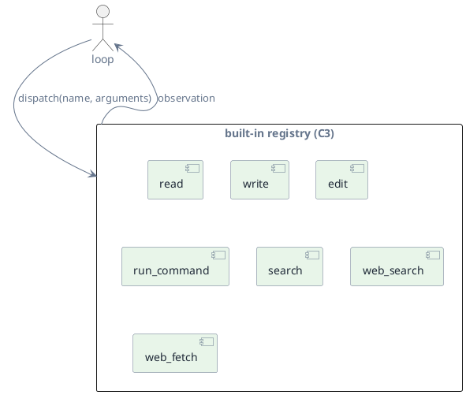
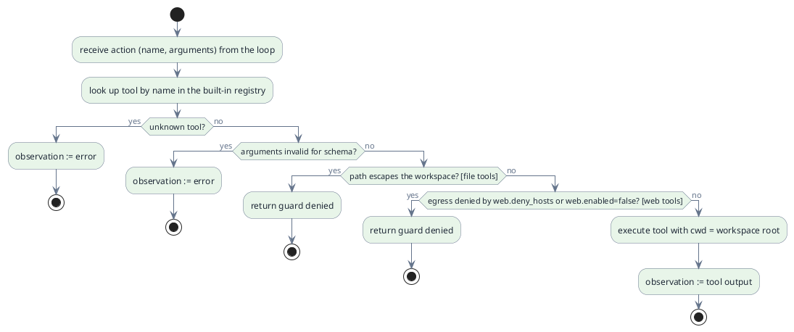

# C3 — Tools

> Status: draft · Version 0.4 · **Current tier: Prop**

Tools are how the loop acts on the world: `C3` is the fixed catalog of
built-in capabilities the model can invoke and the dispatch path that runs
them. The loop reasons; a tool does.

## Overview

A tool is a named function with a description and an argument schema. The
model chooses a tool and arguments; the runtime validates and executes it
and returns the result as an observation. Every tier acts through this same
boundary. The tiers differ in the breadth of the catalog: built-in developer
tools plus guarded, config-gated web access at Prop; richer filesystem and
service connectors at Pilot; and app, messaging, and browser connectors at
Orbit.

Tools return text; they do not decide, loop, or call the model. The loop is
the only place control flow lives, so every tool is a single bounded action.

## Prop

Prop ships a fixed, built-in tool set aligned with coding work on a
codebase: read, write, edit, `run_command`, a local search, and two web
tools (`web_search`, `web_fetch`). It is not extensible at Prop — plugins
and MCP arrive at Orbit (`extensibility`, C14). File tools resolve paths
against the workspace root, and `run_command` starts with the workspace as
its working directory. The web tools exist so a self-hosting agent can look
up API docs, error messages, and package versions; they are on by default,
can be disabled with `web.enabled: false` (config, C6), and are bounded in
time and size.

| Tool | Purpose |
| --- | --- |
| `read` | Read a file from the workspace. |
| `write` | Create or overwrite a file in the workspace. |
| `edit` | Apply a targeted edit to an existing file. |
| `run_command` | Run a shell command rooted at the workspace. |
| `search` | Local text/regex search over workspace files. |
| `web_search` | Query a configured search backend (SearXNG). Present unless `web.enabled` is false. |
| `web_fetch` | Fetch one `http`/`https` URL as text. Present unless `web.enabled` is false. |

- **Fixed set.** The tools above are the entire Prop catalog; nothing is
  loaded from configuration or the user. The two web tools are present
  unless `web.enabled` is set to false.
- **Workspace-rooted.** File tools resolve paths inside `workspace_root`
  (config, C6) and reject a path that escapes it; `run_command` starts with
  that root as its working directory. A rejection is a built-in guard denial,
  returned to the loop rather than executed (`safety`, C10, makes the guard
  configurable). On the human surface the user may approve a denial, which
  opens the guard for the rest of the session (C6); automation always blocks.
- **Network-guarded.** Web egress is allowed by default (any host) and only
  denied when `web.enabled` is false or the host matches `web.deny_hosts`, an
  empty blacklist reserved for later policy. A network denial is a hard block:
  unlike the workspace guard it cannot be opened from the interface.
- **Untrusted content.** Fetched and searched text is data, not instructions:
  results are tagged as untrusted and the agent must not follow directives
  found in them.
- **Configuration.** The workspace root, the network enable flag, the search
  backend URL, and the host blacklist are read from config (C6); the tool set
  itself is fixed and not configurable.
- **Schema-validated.** Arguments are checked against the tool schema before
  execution; a mismatch becomes an observation.
- **Errors are observations.** A recoverable failure is returned as text so
  the loop can re-iterate; a guard denial is returned as such and blocks the
  run (`reliability`, C8), except that the human surface may authorize
  outside-workspace access for the session, in which case that call is
  retried. Network denials are never retried.
- **Bounded.** Web calls run under a dedicated timeout and read at most a
  compiled-in number of bytes; search returns at most a compiled-in number of
  results (C8). The bounds are compiled-in, not configuration.
- **Text results.** Every observation is text; fitting it into the model
  window is `context`'s job (C4), not the tool's.

### Host shell

`run_command` and the interface's direct `!` shell (C6) share one host-shell
abstraction, so the same agent runs on Linux, macOS, and Windows:

- **POSIX (Linux, macOS).** A command runs as `/bin/sh -c <command>`. Where
  `setsid` is available the shell is wrapped so the command leads its own
  process group; that group is what a timeout or cancel kills, so children it
  forked (a compiler, a test runner) are reaped with it. Where `setsid` is
  absent (stock macOS) it falls back to an ungrouped shell.
- **Windows.** A command runs as `cmd.exe /c <command>`; a timeout or cancel
  reaps the whole tree with `taskkill /PID <pid> /T /F`.
- **One timeout, one kill path.** The per-tool-class timeout and the cancel
  signal reach the host shell, not the platform directly, so cancel semantics
  (C8) are identical everywhere.
- **Build per host.** The agent compiles to a native executable
  (`sudoer-prop`, or `sudoer-prop.exe` on Windows); Dart does not
  cross-compile, so each platform's binary is built on that platform.
