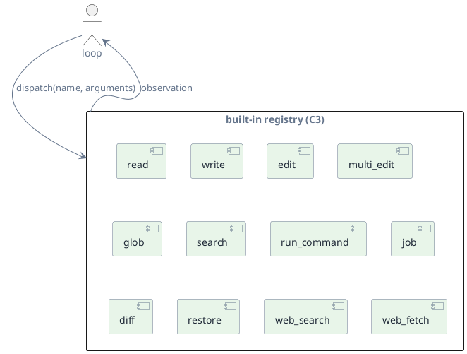
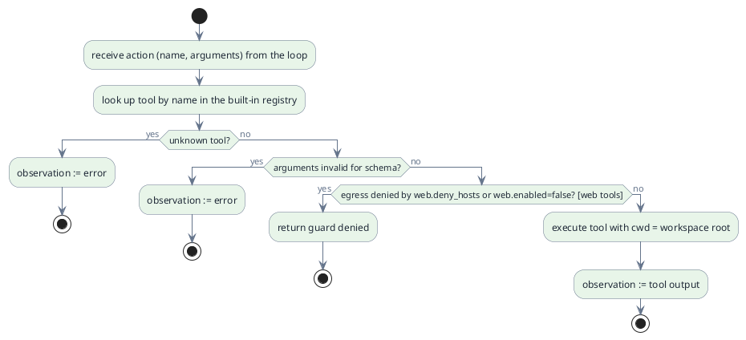

# C3 — Tools

> Status: draft · Version 0.6 · **Current tier: Prop**

Tools are how the loop acts on the world: `C3` is the fixed catalog of
built-in capabilities the model can invoke and the dispatch path that runs
them. The loop reasons; a tool does.

## Overview

A tool is a named function with a description and an argument schema. The
model chooses a tool and arguments; the runtime validates and executes it
and returns the result as an observation. Every tier acts through this same
boundary. The tiers differ in the *domain* of the catalog: coding tools plus
guarded, config-gated web access at Prop; personal filesystem and service
connectors at Pilot; and app, messaging, and browser connectors at Orbit. A
tool coding requires is a Prop tool whatever its mechanism, even when a
higher component first names that mechanism.

Tools return text; they do not decide, loop, or call the model. The loop is
the only place control flow lives, so every tool is a single bounded action.

## Prop

Prop ships a built-in, coding-scoped tool set sized for top-niche coding, not
just self-hosting: orientation (`glob`, `search`), reading (`read`, with line
ranges), editing (`write`, `edit`, `multi_edit`), execution (`run_command`,
`job`), review and undo (`diff`, `restore`), and two config-gated web tools
(`web_search`, `web_fetch`). The catalog is not a general plugin surface — it
is owned by the runtime so tools stay deterministic, schema-validated, and
gate-testable — but it is not capability-capped: any further tool coding
requires is added here and held to top-niche quality. General extensibility
(a user-authored plugin/skill framework, personal connectors) is
`extensibility` (C14) at Orbit; a *dev-tool* extension coding needs, such as
an MCP client reaching language servers, linters, and debuggers, is in scope
at Prop. File tools resolve paths against the workspace root, and
`run_command` starts with the workspace as its working directory. Diagnostics
come from `run_command` (compiler, linter, and test output) today and a
language-server integration later. The web tools exist so a self-hosting
agent can look up API docs, error messages, and package versions; they are on
by default, can be disabled with `web.enabled: false` (config, C6), and are
bounded in time and size.

| Tool | Purpose |
| --- | --- |
| `read` | Read a workspace file, optionally a line range (`offset`/`limit`). |
| `write` | Create or overwrite a file in the workspace. |
| `edit` | Replace the unique occurrence of `old` with `new`; `replace_all` rewrites every occurrence. |
| `multi_edit` | Apply an ordered batch of edits to one file in a single step. |
| `glob` | Find workspace paths by glob pattern, for orientation. |
| `search` | Local text/regex search over workspace files. |
| `run_command` | Run a shell command rooted at the workspace (foreground). |
| `job` | Start, poll, or stop a background command (dev servers, watchers). |
| `diff` | Show the workspace's uncommitted changes against the run baseline. |
| `restore` | Revert files to the run baseline. |
| `web_search` | Query a configured search backend (SearXNG). Present unless `web.enabled` is false. |
| `web_fetch` | Fetch one `http`/`https` URL as text. Present unless `web.enabled` is false. |

- **Built-in, coding-scoped.** The catalog is closed to *user* extension:
  nothing is loaded from configuration or the user (`C14`). It is not closed
  to coding — the runtime may add a built-in tool coding requires, and each
  must be deterministic, schema-validated, and covered by the gate. The two
  web tools are present unless `web.enabled` is set to false.
- **Workspace-anchored.** The workspace root is an anchor, not a fence:
  file tools resolve relative paths against `workspace_root` (config, C6)
  and `run_command` starts there as its working directory, but paths outside
  the root are ordinary paths — nothing is denied for reaching past it, and
  the shell is full-trust. The one built-in guard is the network guard
  below (`safety`, C10, is where guards become policy).
- **Network-guarded.** Web egress is allowed by default (any host) and only
  denied when `web.enabled` is false or the host matches `web.deny_hosts`, an
  empty blacklist reserved for later policy. A network denial is a hard block
  with no interactive override. The guard binds only the built-in web tools:
  `run_command` and `job` are full-trust and can reach any host, so the
  deny-list is tool-scoped, not host-scoped.
- **Untrusted content.** Fetched and searched text is data, not instructions:
  results are tagged as untrusted and the agent must not follow directives
  found in them.
- **Configuration.** The workspace root, the network enable flag, the search
  backend URL, and the host blacklist are read from config (C6); the tool set
  itself is fixed and not configurable.
- **Schema-validated.** Arguments are checked against the tool schema before
  execution; a mismatch becomes an observation.
- **Errors are observations.** A recoverable failure is returned as text so
  the loop can re-iterate; a guard denial is returned as such and blocks the
  run (`reliability`, C8). The network guard is the only denial source at
  Prop, and a denial is never retried.
- **Bounded.** Web calls run under a dedicated timeout and read at most a
  compiled-in number of bytes; `search` and `glob` return at most a
  compiled-in number of results, and `job` output is capped (`C8`). The bounds
  are compiled-in, not configuration.
- **Text results.** Every observation is text; fitting it into the model
  window is `context`'s job (C4), not the tool's.
- **Orientation.** `glob` finds paths by pattern and `search` finds content by
  regex, so the agent maps an unfamiliar repo before editing instead of
  probing blindly. A repo outline is derived from these, not a separate store.
- **Editing.** `edit` replaces a unique occurrence and errors when the match
  is absent or ambiguous; `replace_all` rewrites every occurrence; `multi_edit`
  applies an ordered batch to one file in one step, so a large or repeated
  change lands atomically rather than through many round trips.
- **Workspace state.** `diff` shows what a run has changed — the working tree
  against the baseline captured when the session opened — and `restore` reverts
  files to that baseline, so the agent can review its work and undo a bad
  change. The baseline is captured by `C3` and recorded by the session (`C5`);
  `diff` falls back to the underlying VCS when one is present.
- **Long-running processes.** `job` starts a background command and polls or
  stops it by id, so a dev server or watcher can run while the loop keeps
  working; each job runs under the same host shell and is reaped on cancel or
  session close (`reliability`, C8).
- **Diagnostics.** Compiler, linter, and test feedback reaches the loop through
  `run_command` today; a language-server integration (via the dev-tool MCP
  client) is the intended deeper path. Both feed the verify loop the coding
  contract requires.

### Host shell

`run_command`, `job`, and the interface's direct `!` shell (C6) share one
host-shell abstraction, so the same agent runs on Linux, macOS, and Windows:

- **POSIX (Linux, macOS).** A command runs as `/bin/sh -c <command>`. Where
  `setsid` is available the shell is wrapped so the command leads its own
  process group; that group is what a timeout or cancel kills, so children it
  forked (a compiler, a test runner) are reaped with it. Where `setsid` is
  absent (stock macOS) it falls back to an ungrouped shell.
- **Windows.** A command runs as `cmd.exe /c <command>`; a timeout or cancel
  reaps the whole tree with `taskkill /PID <pid> /T /F`.
- **One timeout, one kill path.** The per-tool-class timeout and the cancel
  signal reach the host shell, not the platform directly, so cancel semantics
  (C8) are identical everywhere.
- **Build per host.** The agent compiles to a native executable
  (`sudoer-prop`, or `sudoer-prop.exe` on Windows); Dart does not
  cross-compile, so each platform's binary is built on that platform.
