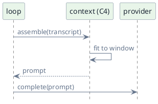
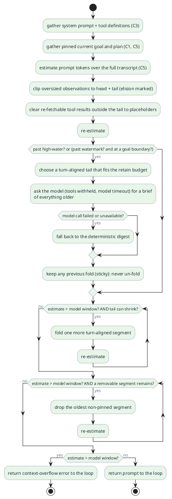

# C4 — Context

> Status: draft · Version 0.9 · **Current tier: Prop**

Context is what the model actually sees: `C4` is the assembly of the prompt
sent to the provider on every turn. The loop decides; context frames the
decision.

## Overview

Before each provider call the runtime builds one prompt from three parts:
the system prompt, the tool definitions, and the conversation so far. It
must fit that prompt inside the model's context window. Every tier shares
this assembly boundary; the tiers differ in how much survives: an in-window
compacted transcript at Prop, prompt caching at Pilot, and a pluggable
engine with retrieval over history at Orbit.

Context is rebuilt on every iteration; it is not a store. Anything that must
outlive a run belongs to `sessions` (C5) or `memory` (C9), not here.

## Prop

Prop fits the session transcript to the window by climbing a ladder of
levers — clip, clear, then fold — never by dropping history silently. The
prompt is the system prompt plus the pinned current goal and plan, a
structured brief of folded work, a **thinned middle** of older but unfolded
turns (oversized observations clipped, stale tool results cleared to
re-fetchable placeholders), and a **verbatim recent tail**. Clipping and
clearing are deterministic and run on every assembly; folding is the only
model-assisted step. Folding happens at a milestone — the first step of a
new goal past a watermark of the window, or mid-run past a higher high-water
mark — so it is deliberate rather than a last-second scramble. The brief is
written by the model in one tools-withheld call under the model timeout, and
falls back to a deterministic digest when that call is unavailable (offline,
the gate, or a failure). Folding is
*sticky*: once history is folded it stays folded rather than re-expanding on
the next step. Folding is turn-aligned, so a tool call is never separated from
its observation. There is no prompt caching — that arrives at Pilot.

- **Zoned prompt.** The assembled prompt is the pinned goal and plan, the
  brief of folded work, the thinned middle, and the verbatim recent tail,
  all under the system prompt and tool definitions. Only the middle and the
  folded region are thinned; the tail is never summarized.
- **Observation truncation.** Any observation above a size cap (default 4k
  tokens) is clipped to its head and tail with an elision marker
  (`… N tokens elided …`), keeping the command echo and the final error and
  dropping the bulky middle. The cap applies everywhere, including the
  recent tail, so one huge read cannot crowd out live work.
- **Tool-result clearing.** Outside the recent tail, the outputs of
  re-fetchable tools (`read`, `search`, `web_fetch`) are swapped for a
  one-line placeholder naming the tool and its path, query, or URL, so a
  later step can re-run the tool and recover the content. Mutating tools
  (`write`, `edit`, `run_command`) keep their command and outcome, thinned
  only by the cap above; clearing never removes an exchange, only its bulk.
  Both levers are deterministic — no model call — and run before any fold
  is considered.
- **Model-written brief.** At a fold the loop makes one provider call with no
  tools, under the model timeout, asking for a brief that preserves the goals,
  the files touched and their current state, the commands and outcomes,
  decisions, errors, and open threads. The call sees only the newly eligible
  work plus the existing brief, and folds the new work into it, so a long
  session never sends the whole history to the summarizer in one prompt. The
  prompt carries each tool call's path or command, so the brief can preserve
  them. The brief is computed once per fold and kept; it is never regenerated
  every step. It can also be triggered on demand by `/compact` (C6), which
  forces a fold below the watermark.
- **Deterministic fallback.** If the brief call fails, times out, or is
  unavailable — offline, the gate, or any error — the fold falls back to a
  locally derived digest, so context fit never depends on a model call.
- **Structured digest.** The fallback digest has named sections — the goals
  seen, the **files touched** (path plus the last action and outcome), the
  commands run and their outcomes, and the errors encountered. Paths, commands,
  and errors survive verbatim; only bulky prose is compressed. The working set
  of files is the same information the model brief is asked to preserve.
- **Working set.** The file section is the run's working set: for each path the
  latest action (`read`, `write`, `edit`, …) and outcome, so a later step can
  still find the files that matter without the full transcript.
- **Verbatim recent tail.** The most recent turns are kept raw — subject only
  to the observation cap — up to a retain budget of the window, so the
  current thread of work is never summarized while it is still live.
- **Turn-aligned folding.** A fold boundary only ever lands before a goal or
  before a tool-call reply, never between a tool call and its observation, so
  the provider always receives a well-formed exchange.
- **Sticky folding.** Once a region is folded it stays folded for the life of
  the session/agent; a later step does not re-expand it just because the raw
  transcript estimate dipped below the trigger again.
- **Milestone trigger.** Folding is not a raw overflow test: it runs at a
  goal boundary (the first step of a new goal) once the prompt passes the
  watermark (75% of the window), or mid-run at the high-water mark (90%), so it
  lands on a natural milestone and keeps headroom.
- **Compaction is reported.** When a new fold happens, the loop surfaces it
  (C6), so the interface can tell the user context was shortened — and whether
  the brief was model-written or the local fallback — rather than silently
  dropping history. Clipped observations carry their elision marker and
  cleared results their re-run pointer, so the model itself sees what was
  thinned and can recover it.
- **Pinned goal and plan.** The current goal and the plan (`C1`) survive
  compaction; the goal is kept even when the fold boundary moves past it.
- **Plan convention in the prompt.** The system prompt instructs the model
  to report plan updates with the fenced `plan` block (the wire convention
  owned by `C2`), so a text-only model can drive the plan without a dedicated
  API field.
- **Cheapest lever first.** The system prompt and tool definitions are pinned;
  everything else thins in cost order — clip, clear, fold, drop. If the
  prompt still overflows after clipping and clearing, more of the tail is
  folded turn-aligned; only if no turn-aligned fold remains are the oldest
  non-pinned segments dropped, and a prompt that still overflows is returned
  to the loop as an error (`reliability`, C8).
- **The stored transcript is unchanged.** Clipping, clearing, and folding are
  assembly-time views on top of `sessions` (C5); the persisted transcript is
  never rewritten, and the brief is not persisted — it is rebuilt (one call)
  on resume if needed.
- **No caching.** The prompt is rebuilt on every iteration; only the brief is
  kept between steps. Prompt-cache reuse across calls arrives at Pilot.
- **Approximate fit.** The token estimate may be approximate; the window is
  `context_window` from provider config (C2).
- **Usage is reported.** The estimate for the last assembled prompt is
  exposed to the loop and, through it, to the interface (C6), so the human
  surface can show context used against the window.

### System prompt

The system prompt is a versioned, pinned artifact, owned here and shipped
with the agent — not assembled ad hoc. It is the coding contract made
executable: the disciplines stated in `agent_prop.md`, expressed as
instructions, plus the conventions of the current workspace. Keeping it fixed
with the build rather than user-tunable (`C10`) is what makes behavior
reproducible and reviewable.

It has stable sections:

- **Identity and role** — Sudoer, a coding agent; strict instruction
  following, verified artifact delivery.
- **Tool guidance** — what each tool is for, and the coding habits the tools
  support: orient with `glob`/`search`, read before editing, prefer
  `multi_edit`, review with `diff`, verify with `run_command`.
- **Coding contract** — the behavior disciplines: orient, ground in the
  codebase, follow conventions, make small edits, verify then claim done, ask
  when ambiguous, report precisely.
- **Plan convention** — the fenced `plan` block the model uses to drive the
  plan (C2), stated for a text-only model.
- **Output format** — concise markdown naming what changed, the commands run,
  and the observed result.
- **Workspace conventions** — the project's own instructions (`AGENTS.md` or
  equivalent) and its detected build, lint, and test commands, inlined so the
  model follows the repo rather than its own defaults.

The prompt is:

- **Pinned and versioned.** The system prompt and the tool definitions are
  pinned — never clipped, cleared, or folded (*above*) — and the prompt carries
  a version stamp. The session records which version produced a run, so a
  prompt change is reviewable and evaluation results stay attributable.
- **Workspace-aware.** At session open, and when the workspace changes (C6),
  the runtime reads the project's instruction file and detected command set
  into the prompt. A workspace with no such file simply omits that section.
- **Image attachments.** When a coding task supplies an image (`modality`,
  C7), the image is attached to the provider request; the transcript stores a
  text reference, and the binary is not persisted in the session.

