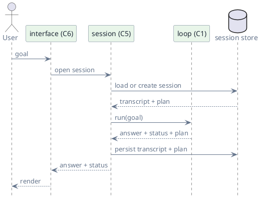
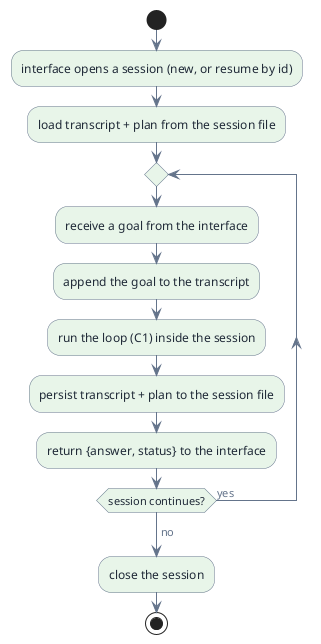

# C5 — Sessions

> Status: draft · Version 0.5 · **Current tier: Prop**

A session is the scope that surrounds a run: `C5` is the container the loop
executes inside and the rules for what state, if any, persists around it.
The loop is one execution; the session is what may be remembered after it.

## Overview

A run (C1) begins with a goal and ends with an answer. A session is the
scope that can span runs, holding the transcript and any associated state.
Every tier runs the loop inside a session; the tiers differ in what the
session retains: a persistent local transcript at Prop, a searchable
session store at Pilot, and multi-device sync with lineage at Orbit.

The store is a local session file at Prop and a searchable store at
Pilot. The session is the layer between the interface (C6) and the loop
(C1): the interface opens or resumes it, the loop runs inside it, and it
hands the run's `{answer, status}` back to the interface.

## Prop

Prop keeps one continuous session. The interface (C6) opens a session at
startup — new, or resumed from disk by id — and every goal is a run inside
that same session. The transcript and the plan survive the run: they are
written to a local session file, so the session can be resumed after the
process exits. Consecutive goals therefore share history, which is what lets
Prop work on a task across many runs and build itself.

- **Continuous.** One session spans many goals and runs; the process does not
  exit after one answer but returns to the prompt (C6).
- **Persistent.** The transcript and plan are written to a local session file
  after each run, so nothing is lost if the process ends.
- **Resumable.** A session has an id; `C6` resumes a saved session and
  continues from its transcript and plan, re-adopting the session's recorded
  `workspace_root`.
- **Workspace.** The session records its active `workspace_root`; changing
  the workspace during a session (`C6`) updates and persists it.
- **Workspace baseline.** When a session opens, `C3` captures a baseline of
  the workspace (file identities and contents), lazily — nothing is copied up
  front, and `diff` falls back to the underlying VCS where one is present; the
  session records its handle so `diff` and `restore` (`C3`) survive across
  runs. It is refreshed only when the workspace root changes (`C6`), is never
  shown to the model, and is not the transcript — it backs review and undo.
- **Session ≠ memory.** Persistence here is continuity of a conversation and
  its plan. Durable, curated, cross-session *knowledge* is `memory` (C9), a
  Pilot component, and is not built here.
- **Local only.** The session file lives on disk beside the agent; there is
  no session store, search, or sync (those arrive at Pilot).
- **Retained on failure.** A blocked or cancelled run still persists its
  partial transcript, so the next goal can recover from it.

### Session file

One JSON document per session, written under the workspace or a configured
session directory; it holds at least `id`, `created_at`, `updated_at`,
`workspace_root`, `plan`, and `transcript`, plus the workspace `baseline`
handle backing `diff`/`restore` (`C3`). The exact shape is frozen in
[session.schema.json](agent_prop/session.schema.json) with the rest of
Prop's contracts (`schemas.md`).
