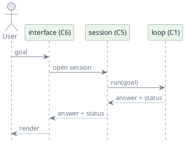

# C6 — Interface

> Status: draft · Version 1.3 · **Current tier: Prop**

The interface is how a human reaches the agent: `C6` is the surface that
takes a goal in and puts an answer out. The loop is the engine; the
interface is the dashboard.

## Overview

Every tier exposes the agent through some surface, and every surface funnels
into the same session (C5) and loop (C1) with a goal and an answer. The
tiers differ in the surfaces offered: a human terminal UI and a line CLI for
automation at Prop, an HTTP API beside them at Pilot, and a gateway
daemon with desktop, chat, and IDE clients at Orbit.



The interface does not reason. It parses input, normalizes it (`modality`,
C7), opens a session, invokes the loop, and renders the result — nothing
about *how* the goal is solved lives here.

## Prop

Prop is a line CLI in both modes; the modes differ only in presentation.
On a terminal the **human** surface renders the normal scrollback with color,
italics, a thinking spinner, a `› ` prompt, streamed replies, and a status
line — no full-screen takeover. Under `--automate`, or when stdin/stdout is
not a terminal (a pipe, a script, the gate), the **automate** surface is
plain, one-shot, and pipe-friendly. Either way, a line that begins with `/`
is a **command** handled locally; any other line is a **goal**, normalized by
`C7` and run inside the current session. There is no server or daemon, but
there is a resident session, and it outlives a single goal.

```plantuml
@startuml
skinparam backgroundColor transparent
skinparam defaultFontColor #64748B
skinparam activityBackgroundColor #E8F5E9
skinparam activityBorderColor #64748B
skinparam activityFontColor #1F2937
skinparam arrowColor #64748B
start
:parse startup arguments; load config; open session (C5);
if (--automate or stdin/stdout not a terminal?) then (yes)
  :automate surface (plain, one-shot);
else (no)
  :human surface (styled, streamed);
endif
repeat
  :read a goal or command;
  if (line begins with "/"?) then (yes)
    :handle command locally;
    if (command is exit?) then (yes)
      :close session; stop
    endif
  else (no)
    :normalize goal (C7); append to session;
    :run the loop (C1) inside the session;
    :stream the reply inline; show a thinking spinner;
    :render answer and status;
  endif
repeat while (still running?) is (yes)
@enduml
```

### Commands

| Command | Effect |
| --- | --- |
| `/help` | list commands |
| `/exit`, `/quit` | persist and close the session, then exit |
| `/new` | start a new session (new id) |
| `/sessions` | list saved sessions |
| `/resume <id>` | switch to a saved session |
| `/plan` | print the current plan (C1) |
| `/status` | print the current run status and budget use (C1, C8) |
| `/cancel` | cancel the in-flight run (C1, C8); automate surface only |
| `/compact` | fold earlier context into a brief now (C4) |
| `/workspace [path]` | print or change the workspace root (C3) |
| `/verbose on\|off` | emit per-step diagnostics on stderr (off by default) |

Behavior change on the fly is limited to session and interface concerns —
the active session, the plan, the workspace root, and verbosity. Changing
the provider, model, or safety policy is a Pilot concern (`C2`, `C10`)
and is not offered here.

- **Human surface (inline).** Stays on the normal scrollback: a `› ` prompt,
  color and italics for user/tool/status lines, a spinner while thinking, the
  reply streamed in as it is generated, and a one-line status after each run
  (the response number within the session, the result, context use against the
  window as `used/window (percent)` with token counts in K/M units, plan
  progress, step/budget, workspace).
  No alternate screen and no full-screen takeover.
- **Interactive input (raw terminal).** On a real terminal the human surface
  takes over the keyboard for line editing: Left/Right move the cursor to
  insert or correct, Up/Down walk the input history (the in-progress draft is
  restored when you return to it), Home/End jump within the line, and
  Backspace/Delete edit. A line ending in `\` continues onto the next line
  (drawn with a `  ` continuation prompt), so a goal may span multiple lines,
  and `/help` notes the gesture; a plain Enter submits. Only a line that starts a submission is a command: a
  `/` command sitting on a continuation line is goal text, and the interface
  says so rather than silently sending it to the model. While a run is in
  flight the thinking spinner carries
  an `press Esc twice to interrupt` hint, and a double `Esc` cancels the run
  immediately (the partial transcript is kept). On Windows the console is put
  into virtual-terminal input mode first, so these keys reach the editor as
  bytes instead of being swallowed by the legacy console. Off a terminal — a
  pipe, `--automate`, or the gate — the plain line path is used and none of
  this applies.
- **Direct shell (`!`).** On the interactive human surface a submitted line
  beginning with `!` is run directly as a shell command in the workspace root;
  its stdout and stderr are forwarded verbatim and the model is never involved.
  It runs through the same host shell as `run_command` (C3) — `/bin/sh -c` on
  POSIX, `cmd.exe /c` on Windows — so the escape hatch is platform-neutral.
  This is a human-CLI escape hatch only: `/help` lists it, a `!` line is not
  interruptible (the double `Esc` gesture does not apply to it), and on the
  automate surface a `!` line is an ordinary goal.
- **Visual channels.** Each kind of output gets its own colour and mark, so a
  transcript is easy to scan and the three voices never blur together:
  - **User input** stays in the terminal's default color: the `› ` prompt and
    the typed line are exactly what the tty shows, so nothing about typing
    changes. Off a terminal (a pipe) the interface prints the goal once as a
    default-colored `❯ ` header.
  - **Model output** (the answer) is rendered markdown in magenta, with its
    own accents (sky headings, peach inline code, mauve list markers), so the
    model's voice is unmistakable against the default-colored input and the
    yellow command output.
  - **Command output** (`/help`, `/plan`, `/status`, … — local, not the model)
    is yellow.
  - **Private reasoning** (`<think>`, C2) is a dim italic `│` block, so it
    reads as an aside and is clearly not the answer.
  - **Tool calls** are mauve `→` lines; **tool/command results** are coloured
    `✓`/`✗` lines with a multi-line body indented and capped beneath them.
  - **Verbose `[C1]`–`[C8]` diagnostics** are a dim gutter with a
    colour-coded tag; **errors and blocked runs** are red; the **status line**
    is a dim rule with the result coloured (green complete, yellow
    incomplete, red blocked).

  Styling is presentation only — with color off, each channel degrades to its
  plain prefix and stdout stays machine-readable.
- **Markdown rendering.** The model's reply is markdown, so the human surface
  renders it: headings, emphasis, inline code, fenced code (with a language
  tag), lists, task items, blockquotes, horizontal rules, links, and tables
  (with aligned columns). Rendering is block-buffered — a block is emitted
  when it completes at a blank line or a closing code fence, and the rest is
  flushed at the end of the step — so the display is always a correct,
  complete block rather than a half-typed one. Rendering is on for the human
  surface only; the automate surface keeps the raw markdown so its stdout
  stays machine-readable.
- **Mode switch.** Human is the default on a terminal. `--automate` forces
  the plain surface; a non-interactive stdin/stdout selects it automatically,
  so scripts, pipes, and the gate never block on a prompt. `--human` forces
  the styled surface when terminal detection is wrong.
- **Streaming.** On the human surface the provider streams generated text
  (`C2`) and the loop forwards visible deltas (`C1`), which are written inline
  to stdout, while reasoning deltas (`<think>`, C2) stream dim and italic to
  stderr. A plan block is withheld until it is complete, so it is never shown
  as it arrives. Automation takes the one-shot path and gets the whole reply
  at once.
- **Timing.** Each provider response and each tool dispatch is measured
  (`C1`) and reported, so the cost of a slow model or command is visible.
  On the human surface the thinking spinner ticks up the elapsed time of the
  call once it passes a second, placed right after the phase word
  (`thinking · 3.2s · ctx 421/8.2K`); the response latency rides as a dim
  `· 2.4s` suffix on the `→` tool line it produced, tool results carry their
  own `· 0.03s`, and the run total leads the status line in place of the
  status word (e.g. `8.4s #3 · …`), still coloured by the run's status. The
  automate surface leaves stdout untouched and prints plain
  `timing: <span> <duration>` lines on stderr after the run. Timings are
  runtime-only and are never written to the session or the run wire shape.
- **Resident session.** The program stays running across many goals; it exits
  only on `/exit`, `/quit`, Ctrl+C, or end of input (EOF).
- **Command vs goal.** A leading `/` marks a local command; everything else
  is a goal for the loop. This keeps interface control from being sent to
  the model.
- **Output channels.** Answers (streamed or whole) go to stdout; reasoning,
  diagnostics, the plan, status, and errors go to stderr, so stdout stays
  machine-readable even on the human surface.
- **Context compaction.** When `C4` folds earlier transcript into a summary,
  the human surface reports it as command output
  (`↺ compacted N earlier steps … (before → after tokens)`), so the user sees
  that context was shortened instead of it happening silently; the verbose
  `[C4 context]` diagnostic carries the same detail.
- **Manual compaction.** `/compact` folds the current session's older context
  into a brief on demand (C4), even below the automatic watermark, then
  reports the same `↺ compacted …` line. It works on both surfaces; a session
  with nothing foldable reports that instead of making a call.
- **Outside-workspace authorization.** A guard denial (C3) on the human
  surface stops the run and asks in place, e.g.
  `⚠ read needs to reach outside the workspace … [y/N]`. `y` opens the guard
  for the rest of the session and retries the call immediately; `n`, `Enter`,
  or `Esc` blocks as before. The grant lasts for the session and is not
  persisted; automation never prompts.
- **Verbose diagnostics.** `/verbose on` makes each component report its
  internal routing and behavior as `[C1]`–`[C8]`-tagged lines on stderr: the
  run/session/provider selection, the assembled prompt fit (`C4`), the tool
  call and its evaluated result (`C3`), plan updates and progress/stall
  accounting (`C1`), guard timeouts (`C8`), and the final status. It is off by default
  and never touches stdout.
- **Exit codes.** A clean exit is zero; a non-zero code is reserved for a
  fatal startup or configuration error. Per-run outcomes are reported as
  status, not exit codes.
- **Cancellation.** A run is aborted at once (C8) — a model request is cut off
  mid-stream and a running command is killed — so the surface returns
  immediately instead of waiting for the model to finish; the session and its
  partial transcript are kept. The gesture differs by surface: on the automate
  surface input is read *concurrently* with the run, so a `/cancel` line that
  arrives mid-run interrupts it, and `/cancel` is the only cancel command
  listed in its `/help`; on the human surface the run owns the line editor, so
  a double `Esc` is the interrupt gesture, `/cancel` is not offered (absent
  from `/help` and rejected as an unknown command), and a `/cancel` typed
  mid-run is not delivered. Both surfaces reach the same cancel signal.
- **Clarifying questions.** If the loop finishes with a question (C1), it is
  printed like any answer; the user's reply is the next goal, in the same
  session, so the conversation continues.
- **Text only.** Input and output are text (`modality`, C7).

### Configuration

Prop reads one configuration source at startup, owned here and passed
down; each component reads only its own keys. The source is a single JSON
file, selected by `--config` / `-c` or the `SUDOER_CONFIG` environment
variable and defaulting to `sudoer.json` in the process working directory.
The name is tier-agnostic: Prop, Pilot, and Orbit all read `sudoer.json`.

A missing config is a fatal startup error, not a silent default: before any
session opens, the resolved path it looked for and a copy-pasteable sample
config (the same shape as the README example) are written to stderr, and the
process exits non-zero. The user can create the file in place and retry.

| Key | Owner |
| --- | --- |
| `provider kind`, `base_url`, `api_key`, `model`, `context_window` | providers (C2) |
| `workspace_root`, `web.enabled`, `web.search_url`, `web.deny_hosts` | tools (C3) |
| `session_dir` | sessions (C5) |

`workspace_root` is optional: when omitted it defaults to the process
working directory at startup, and it may be changed during a session with
`/workspace`.

The budget bounds and per-tool-class timeouts are compiled-in constants, not
configuration — they are built-in guards (`reliability`, C8). Provider
settings are fixed for the process; session-level, non-policy settings
(active session, workspace root, verbosity) may change during a session via
commands. User-tunable policy and model/provider switching arrive with
`safety` (C10) and the Pilot catalog (C2).
