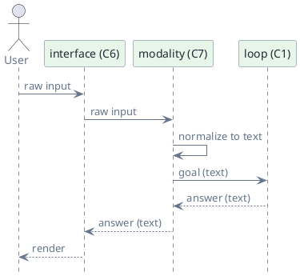
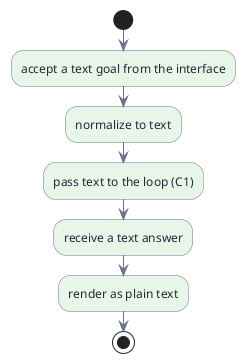

# C7 — Modality

> Status: draft · Version 0.4 · **Current tier: Prop**

Modality is the shape of information crossing the boundary: `C7` defines
what kinds of input the agent accepts and what kinds of output it produces.
The loop is the same; modality is the alphabet it works in.

## Overview

A goal arrives in some modality and the answer leaves in some modality; the
runtime normalizes input to a form the loop and provider can consume and
renders output back to the caller. Modality sits between the interface (C6)
and the loop (C1): the interface parses raw input, modality normalizes it to
text, and the loop runs on text. Every tier speaks text; the tiers differ in
what else is possible: text at Prop and Pilot, image input at Prop only where
a coding task needs it, and general vision plus audio at Orbit.

The session wrapper (C5) is omitted here for clarity; in practice the loop
runs inside a session.

## Prop

Prop is text-first. Input is normalized to text before the loop sees it, and
the answer is rendered as plain text. Image input is supported only where a
*coding* task requires it — reviewing a UI screenshot or a diagram — never as
a general modality; audio is not supported.

- **Text-first.** Text is the default input and the output modality; image
  input is a coding-only exception, not a general capability.
- **Pass-through.** Beyond normalization the component adds no transformation;
  it is the boundary that general vision and audio extend at Orbit, while the
  coding-required image path is enabled at Prop.
- **Normalized input.** The interface (C6) parses raw input, then modality
  trims and decodes it to text before the loop runs; no structured payloads,
  and the only binary input is a coding task's image, which arrives as an
  `@path` token on the goal line (C6) — stripped from the text, validated
  (the path must exist and be an image file), and attached for that goal.
- **Plain rendering.** The answer is emitted as plain text; no rich
  rendering is required of the caller.
- **Provider modality.** The provider (C2) is asked for text completions,
  plus image input only when a coding task supplies one.
- **No file attachments.** Files are not accepted as input; the agent reaches
  files through tools (C3). An image a coding task supplies (e.g. a
  screenshot) is the one attachment routed through.
- **Image attachment.** A coding task's image — supplied as an `@path` token
  (C6) — is passed to that goal's provider requests as an attachment; the
  transcript keeps a text reference only, and the binary is not stored in the
  session.
