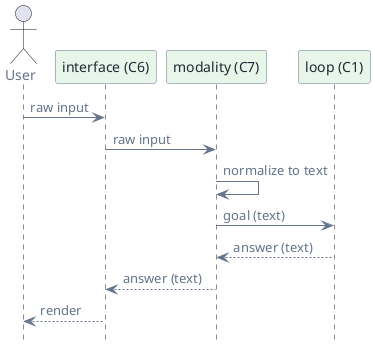
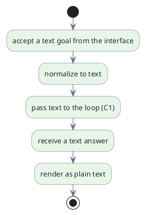

# C7 — Modality

> Status: draft · Version 0.2 · **Current tier: Prop**

Modality is the shape of information crossing the boundary: `C7` defines
what kinds of input the agent accepts and what kinds of output it produces.
The loop is the same; modality is the alphabet it works in.

## Overview

A goal arrives in some modality and the answer leaves in some modality; the
runtime normalizes input to a form the loop and provider can consume and
renders output back to the caller. Modality sits between the interface (C6)
and the loop (C1): the interface parses raw input, modality normalizes it to
text, and the loop runs on text. Every tier speaks text; the tiers differ in
what else is possible: text only at Prop and Pilot, and vision plus
audio at Orbit.

The session wrapper (C5) is omitted here for clarity; in practice the loop
runs inside a session.

## Prop

Prop is text in, text out. Input is normalized to a plain string before the
loop sees it, and the answer is rendered as plain text. There are no
attachments, no images, and no audio.

- **Text only.** The only supported input and output modality is text.
- **Pass-through.** Beyond normalization the component adds no transformation; it
  is the fixed boundary that vision and audio extend at Orbit.
- **Normalized input.** The interface (C6) parses raw input, then modality
  trims and decodes it to text before the loop runs; no structured or binary
  payloads.
- **Plain rendering.** The answer is emitted as plain text; no rich
  rendering is required of the caller.
- **Text-only provider.** The provider (C2) is asked for text completions
  only.
- **No attachments.** Files are not accepted as input; the agent reaches
  files through tools (C3) instead.
