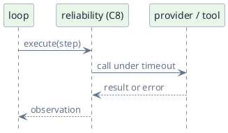
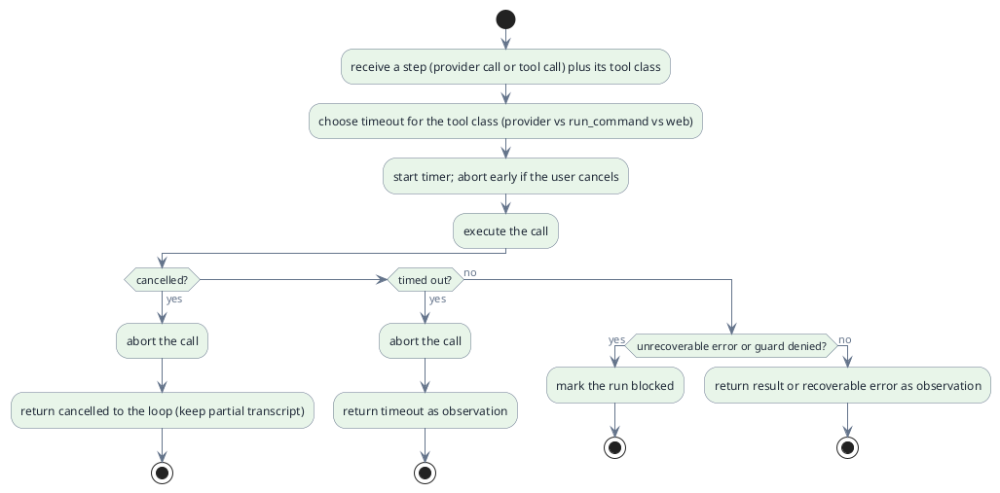

# C8 — Reliability

> Status: draft · Version 0.7 · **Current tier: Prop**

Reliability is what keeps a run bounded and recoverable: `C8` defines the
guardrails around every step and the rules for turning failures into
observations. The loop drives; reliability keeps it from running away or
dying silently.

## Overview

Every tier runs the loop under the same guardrails, and every provider and
tool call passes through them. The tiers differ in how much recovery and
observability is added: a progress-driven budget, per-tool-class timeouts,
in-loop retry, and cancellation at Prop; structured logs, provider
retry/backoff, and concurrent runs at Pilot; tracing, cost accounting, and
self-heal at Orbit.

Reliability wraps calls; it does not decide what to do with the result. The
loop owns control flow (retry by re-iterating, or block), while reliability
owns the bounds on each call.

## Prop

Prop defines four guards: a progress-driven budget, per-tool-class
timeouts, in-loop retry, and user cancellation. The budget bounds and the
timeouts are compiled-in constants — they are built in and not configuration
or policy (`safety`, C10, is where guards become policy). A timeout or other
recoverable error is returned to the loop as an observation, which
re-iterates and counts toward the stall budget unless it makes progress; an
unrecoverable error or a guard denial marks the run blocked.

- **Progress-driven budget.** A run is bounded by *stalls*, not by raw step
  count: it continues while steps make progress — a plan item newly completed,
  or an observation not seen before in the run — and ends after a compiled-in
  number of consecutive non-progress steps. A repeat of the same call with the
  same result, a recoverable error, or a timeout makes no progress and counts
  toward the stall budget, so a loop that keeps producing the same output is
  cut off. A much larger compiled-in step ceiling remains only as a runaway
  safety net, so long productive work is never cut off by step count. The
  bound is enforced by the loop (C1) and cannot be raised by the user at
  Prop.
- **Per-tool-class timeouts.** Every provider and tool call is bounded by a
  timeout chosen by class: a model timeout for provider calls, a longer build
  timeout for `run_command` (C3) so compilers and test suites can finish, and
  a shorter web timeout for the network tools (C3). On expiry the call is
  aborted and surfaced as a timeout. A streamed provider call uses an
  *inactivity* timeout — reset on each chunk — instead of a single total
  deadline, so an actively producing stream is not cut off.
- **Cancellation.** A user cancel (`interface`, C6) is noticed inside the
  in-flight call, not only between steps: the loop passes the cancel signal
  into the provider or tool, which aborts at once — the provider's HTTP
  request and response stream are closed, and a running `run_command` process
  is killed — and ends the run without marking it blocked; the partial
  transcript is kept in the session (C5). A call that is already consuming
  model output stops where it is rather than waiting for the stream to
  finish.
- **In-loop retry.** There is no separate retry counter or backoff: a
  recoverable error (including a timeout) is returned as an observation, and
  the loop simply re-iterates, each iteration counting toward the stall budget
  unless it makes progress.
- **Deep abort.** Aborting a timed-out provider call cancels the HTTP
  request; aborting a timed-out `run_command` (C3) must terminate the whole
  child process tree so no processes leak.
- **Batch steps.** A step's tool calls each run under their class timeout; the
  independent read-only calls run in parallel, so the step's wall time is the
  longest call rather than their sum, and one call's timeout or denial does not
  discard its already-completed siblings' observations.
- **Background jobs.** A `job` (C3) runs under the same host shell as
  `run_command`; a job that exceeds its class budget is stopped and reported,
  and every job is reaped when the run is cancelled or the session closes, so
  no child process outlives the agent.
- **Blocking.** An unrecoverable error or a guard denial marks the run
  blocked and the loop aborts.
- **Best-effort finish.** If the run stalls or hits the step ceiling, the loop
  makes one final provider call under the model timeout, with tools withheld
  so the model must answer in text; it does not re-enter the loop and the
  answer is marked incomplete (C1). If that call fails or comes back empty,
  the answer falls back to a local summary of the plan and last observation.
- **No logging or backoff.** Structured logs, provider retry/backoff, and
  concurrent *runs* are Pilot concerns; at Prop the only parallelism is the
  read-only calls within one step (*Batch steps*).
