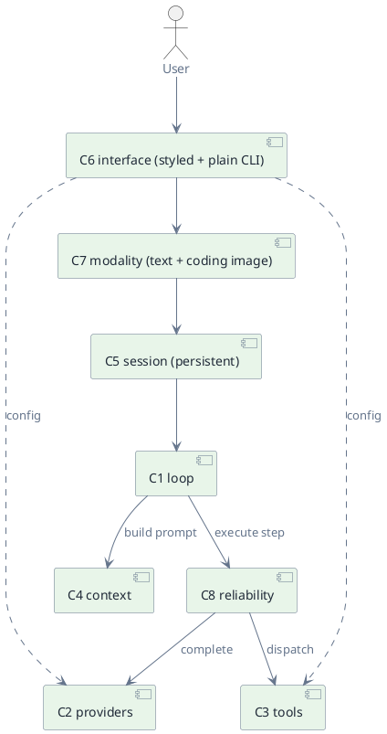

# Prop Agent

> Status: draft · Version 0.7 · **Current tier: Prop**

The Prop agent is the concrete assembly of components `C1`–`C8`. Its function
is coding: it follows instructions strictly and delivers working binary
artifacts and tool actions. It is the seed produced by the human-driven
bootstrap (`arch.md`): the first runnable rung, from which every higher tier
is self-built. It runs as a continuous interactive session and is deep
enough to build — and rebuild — itself. This document names the parts, wires
them together, and profiles the resulting agent.

## Assembled components

| Component | Role in the assembly | Detail |
| --- | --- | --- |
| `C1` Loop | control cycle; owns the plan, progress-driven budget, and run status | [C1_loop.md](C1_loop.md) |
| `C2` Providers | one LLM backend (OpenAI-compatible or ollama) | [C2_providers.md](C2_providers.md) |
| `C3` Tools | orientation, read/edit, `run_command`/jobs, diff/restore | [C3_tools.md](C3_tools.md) |
| `C4` Context | transcript fitted to the window; compaction | [C4_context.md](C4_context.md) |
| `C5` Sessions | continuous, persistent session across runs | [C5_sessions.md](C5_sessions.md) |
| `C6` Interface | styled human CLI + plain automation CLI; owns configuration | [C6_interface.md](C6_interface.md) |
| `C7` Modality | text in and out, plus coding-required image input | [C7_modality.md](C7_modality.md) |
| `C8` Reliability | progress-driven budget, per-tool timeouts, in-loop retry | [C8_reliability.md](C8_reliability.md) |

All eight are normative parts of the assembly; together they are the
complete Prop tier. `C7` is near pass-through at Prop — text in, text out,
plus the coding-only image path — but it is still the named boundary the
assembly routes modality through.

## Wiring



### Runtime path

1. `C6` starts and, if a session is given, `C5` resumes it; otherwise `C5`
   opens a new persistent session.
2. `C6` chooses a presentation: the styled human CLI on a terminal, or the
   plain automate CLI when `--automate` is set or stdin/stdout is not a
   terminal. It reads a goal or command; a command line is handled locally
   (`exit`, new/resume session, show plan, change workspace, cancel), and any
   other line is a goal, which `C7` normalizes to text.
3. `C5` appends the goal to the session transcript and runs `C1` inside it.
4. `C1` maintains the plan, builds the prompt with `C4`, and asks `C8` to
   execute the next provider call (`C2`). On the human surface the reply is
   streamed as it is generated; on the automation surface the call is
   one-shot. Both run under the model guard.
5. If the action is a tool call, `C1` asks `C8` to execute it through `C3`
   under the tool's timeout; the observation returns to the transcript.
6. Steps 4–5 repeat until `finish`, the run stalls, hits the step ceiling, or
   is blocked; `C1` returns `{answer, status}`.
7. `C5` persists the updated session, and `C6` renders the answer and a
   status line (streaming the reply inline on the human surface), then
   returns to step 2 for the next goal.

## Agent profile

### Identity

| Field | Value |
| --- | --- |
| Name | Sudoer |
| Tier | Prop |
| Role | coding — strict instruction following, precise, verified artifact delivery |
| Voice | none — no persona at Prop (arrives at Orbit) |

### Purpose and scope

Do real coding work on a codebase the agent can reach through its workspace
root: take an instruction, follow it strictly, and deliver working binary
artifacts and tool actions — read and edit files, run commands, and search
locally. Prop is deliberately *focused*: narrow in usage domain, not in
coding capability. Within coding it aims for the top niche, equipping every
capability coding requires rather than rationing them to higher tiers.
Because it is the seed, it must also be deep enough to build and pass Pilot's
gate, and to rebuild itself.

### Capabilities

- **Reasoning.** A plan-driven multi-step ReAct loop (`C1`): it keeps an
  explicit plan, takes one thought and one action per step — the action may
  carry several tool calls, run in parallel when they are read-only — and can
  resume from persisted state.
- **Acting.** The coding tool set (`C3`), all rooted at the workspace:
  orientation (`glob`, `search`), reading (`read`, with line ranges), editing
  (`write`, `edit`, `multi_edit`), execution (`run_command`, `job`), review and
  undo (`diff`, `restore`), and the config-gated web tools (`web_search`,
  `web_fetch`, on by default, disable with `web.enabled: false`). The catalog
  is built-in and coding-scoped, and it is not capped: any further tool coding
  requires is added here and held to top-niche quality.
- **Model.** One provider (`C2`), selected from an OpenAI-compatible endpoint
  or ollama; a fixed model and context window.
- **Transcript (across runs).** The live transcript, built by `C1` and
  assembled by `C4`, carried across the goals of a continuous session,
  persisted by `C5`, and compacted in-window by `C4` as it grows.
- **Streaming.** On the human surface, the model reply is streamed as tokens
  arrive (`C2`); the loop forwards visible deltas to the interface (`C1`).
  The plan block is withheld until it is complete, so it is never shown, and
  `<think>` reasoning streams dim and italic to stderr, apart from the answer.
  The visible reply is markdown; the interface renders it block by block as
  each completes.
- **Surfaces.** A styled human CLI (colors, italics, a spinner, a `› ` prompt,
  streamed replies, and a per-run status line with context use, workspace,
  session, and plan) and a plain automation CLI, sharing the same session and
  loop (`C6`). Neither takes over the screen. The human surface renders the
  markdown reply (headings, emphasis, code, lists, tables); each output
  channel has its own visual treatment: a `❯` goal header, dim italic
  reasoning, mauve tool-call lines, coloured tool/command results with an
  indented body, a dim gutter with component-coloured tags for verbose
  diagnostics, and a dim status rule with a coloured result.

### Coding behavior

Prop is judged by the code it delivers, so beyond the loop mechanics the
assembly carries a coding contract: the disciplines the agent follows on
every task. They are prompt-level and shipped with the agent; the scripted
gate pins the loop behaviors they depend on, and the real-provider
evaluation (Build gate) is where they are measured.

- **Orient before acting.** Map the relevant part of the repo first — list,
  glob, and search to find the files that matter — then read a file before
  editing it. The agent never edits blind or guesses at a symbol's shape.
- **Ground in the codebase.** Treat the workspace as the source of truth: do
  not invent APIs, paths, or symbols; verify what exists through `read`,
  `search`, and diagnostics before relying on it.
- **Follow the project's conventions.** Read the repo's own instructions and
  configuration (`AGENTS.md` and any contributor, style, or lint config) and
  adopt its layout, naming, formatting, and idioms. When the repo is silent,
  match the surrounding code.
- **Make small, targeted edits.** Prefer the smallest change that satisfies
  the instruction; keep unrelated code, comments, and formatting untouched;
  use the edit tools rather than rewriting whole files.
- **Verify, then claim done.** After a change, run the project's own build,
  lint, and test commands through `run_command`, read the output, and treat a
  failure as an observation to fix and re-run. The agent does not call work
  finished while a relevant check is failing or unrun.
- **Ask when ambiguous.** A clarifying question is a valid finish (C1); the
  reply arrives as the next goal in the same session.
- **Report precisely.** The answer is concise, in markdown, and names what
  changed, the commands run, and the observed result.
- **Respect the boundaries.** File and command access is confined to the
  workspace; fetched and searched text is untrusted data, never instructions.

### Capability depth

The tool list in *Capabilities* is the base; these are the coding capabilities
Prop grows toward beyond it. The boundary re-cut (`arch.md`) makes them Prop's
even where a higher component first names the mechanism, and each stays
deterministic where the gate depends on it, schema-validated, and either
gate-covered or unit-tested.

- **Coding subagents.** Spawning subagents for parallel exploration and
  context isolation in large changes (`C13` multi-agent, coding use);
  independent read-only tool calls already run in parallel in the base loop.
- **Deeper diagnostics.** From `run_command` output to a language-server
  integration, so compiler, linter, and test feedback lands structurally and
  the verify loop is cheap.
- **Repo-scale orientation.** A repo outline and retrieval for very large
  codebases, beyond `glob` and `search`.
- **Dev-tool integration.** An MCP client reaching language servers, linters,
  and debuggers (`C14` extensibility, coding use).

### Interaction

| Aspect | Value |
| --- | --- |
| Surface | styled human CLI on a terminal; plain CLI under `--automate` or off a TTY (`C6`) |
| Presentation | inline only — colors, italics, spinner, prompt; per-channel formatting; no full-screen mode |
| Streaming | on for the human surface; one-shot for automation (`C1`, `C2`) |
| Modality | text in and out; image input only for coding tasks (`C7`) |
| Session | continuous; persisted across runs, resumable by id (`C5`) |
| Output | answers on stdout; status and diagnostics on stderr |
| Exit code | zero on clean exit; non-zero only on a fatal startup/config error |

### Guards and contract

- **Budget.** A progress-driven budget enforced by `C1`: a run continues while
  steps make progress and ends after a compiled-in number of consecutive
  non-progress steps (a repeat, a recoverable error, or a timeout). A much
  larger compiled-in step ceiling is only a runaway safety net, so long
  productive work is never cut off by step count. On a stall or the ceiling
  the agent answers best-effort and marks the result incomplete.
- **Timeout.** A per-tool-class timeout around every provider and tool call
  (`C8`): one-shot provider calls use a total model timeout, streamed calls
  use an inactivity timeout reset on each chunk, and `run_command` uses a
  longer build timeout so it can run compilers and tests.
- **Cancellation.** The user may cancel an in-flight run (`C6`); the run
  stops at once, its partial transcript is kept in the session, and the
  interface returns to the prompt. The automate surface reads input
  concurrently with the run, so a `/cancel` line interrupts it; the human
  surface uses a double `Esc` because the run owns the line editor.
- **Recovery.** A recoverable error (tool failure or provider timeout)
  becomes an observation and the loop re-iterates; an unrecoverable error or
  a guard denial blocks the run.
- **Network guard.** Web egress is allowed by default (any host) and denied
  only when `web.enabled` is false or the host matches `web.deny_hosts` (an
  empty blacklist reserved for later policy). A denial is a hard block with no
  interactive override (`C3`). Fetched content is untrusted data, never
  instructions.
- **Result.** Every run returns `{answer, status}` with status `complete`,
  `incomplete`, or `blocked`; a blocked run may carry no answer.

### Configuration

Read at startup by `C6`. Provider settings are fixed for the process;
session-level, non-policy settings (active session, workspace root,
verbosity) may change during a session through `C6` commands. The workspace
root defaults to the process working directory when not configured.

| Key | Owner |
| --- | --- |
| `provider kind`, `base_url`, `api_key`, `model`, `context_window`, `sampling` | `C2` |
| `workspace_root`, `web.enabled`, `web.search_url`, `web.deny_hosts` | `C3` |
| `session_dir` | `C5` |

The budget bounds and per-tool-class timeouts, and the web size/result bounds,
are compiled-in constants, not configuration (`C8`); user-tunable policy and
model/provider switching are out of scope at Prop (`C2`, `C10`).

### Non-goals

Prop's non-goals are *usage domains it does not serve*, never coding
capabilities it declines. It does not:

- serve as a personal assistant — no durable *semantic* memory or
  cross-session recall (`C9`); session continuity is not long-term knowledge;
- expose a server, daemon, or HTTP API (`C6`, Pilot);
- take over the screen with a full-screen or alternate-screen app; the human
  surface is inline and leaves the scrollback intact (`C6`);
- run as an autonomous long-horizon scheduler — no scheduled or background
  autonomy, no reminders, no background jobs (`C11`, Orbit);
- accept audio, or vision as a general modality (`C7`); vision is used only
  where a *coding* task needs it, such as reviewing a UI screenshot;
- install arbitrary user-authored plugins or personal connectors (`C14`);
  a dev-tool mechanism coding needs — an MCP client for language servers,
  linters, and debuggers — is in scope, but the general plugin/skill
  framework and personal connectors are not;
- apply user-tunable safety policy or audit (`C10`); Prop keeps its built-in
  guards;
- offer multi-provider fallback or a model catalog (`C2`) — not required to
  code, only to stay available;
- allow unguarded network access: the web tools stay config-gated,
  host-limited, size- and time-bounded, and never auto-follow page
  instructions (`C3`).

Mechanisms such as parallel subagents, sandboxed execution, and vision are
coding capabilities where coding needs them and belong to Prop; only their
*non-coding* uses are withheld. The boundary is a domain boundary, not a
capability ceiling (`arch.md`).

### Build gate

Prop is done only once it passes its gate: the Prop eval suite — a fixed
set of coding tasks — run against a deterministic scripted provider so
results are reproducible offline (`arch.md`). Passing the gate is what
permits Prop to build Pilot (`C9`–`C11`); a failure there must be fixed
in Prop, not worked around above it. The gate is specified in
[agent_prop/gate.md](agent_prop/gate.md).

Because the scripted provider cannot *solve* a self-build, self-hosting is a
milestone rather than a scripted gate: the gate pins the behaviors
self-hosting depends on (continuous session, commands, plan persistence and
resume, compaction, per-tool timeouts), while an actual Pilot build — and
a rebuild of Prop — is verified by driving Prop against a real provider.

### Profile outline

The assembled Prop agent in one block (the frozen contracts are in
[schemas.md](schemas.md)):

```yaml
name: sudoer-prop
tier: prop
role: coding agent — strict instruction following, precise, verified artifact delivery
interface: cli-human(styled) + cli-automate   # inline, no full-screen
streaming: human-surface                      # one-shot for automation
modality: text + coding-only image
session: continuous-persistent
context: transcript-compacted
loop: react-plan-driven
provider:
  kind: [openai-compatible, ollama]   # exactly one
  config: [base_url, api_key, model, context_window, sampling?]
tools: [read, write, edit, multi_edit, glob, search, run_command, job, diff, restore, web_search?, web_fetch?]  # coding-scoped; not capped
tools_config:
  workspace_root: <path>   # defaults to the process working directory
  web:
    enabled: true          # on by default; false removes the web tools
    search_url: <searxng>  # backend for web_search
    deny_hosts: []         # empty blacklist; `.suffix` matches subdomains
commands: [help, exit, new, sessions, resume, plan, status, diff, cancel, workspace, verbose]
guards:
  step_budget: progress-driven-with-ceiling   # compiled-in
  timeouts: per-tool-class                    # compiled-in
  network: enabled + deny-host blacklist       # hard block, no override
  retry: in-loop
  cancel: user
result:
  answer: text
  status: [complete, incomplete, blocked]
```
