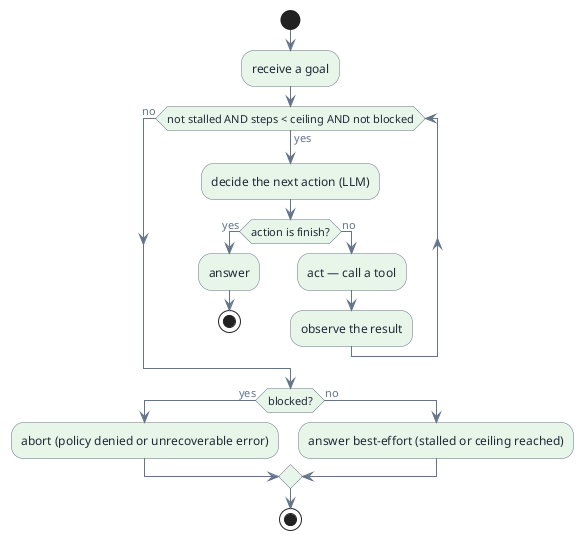
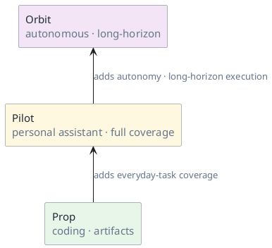
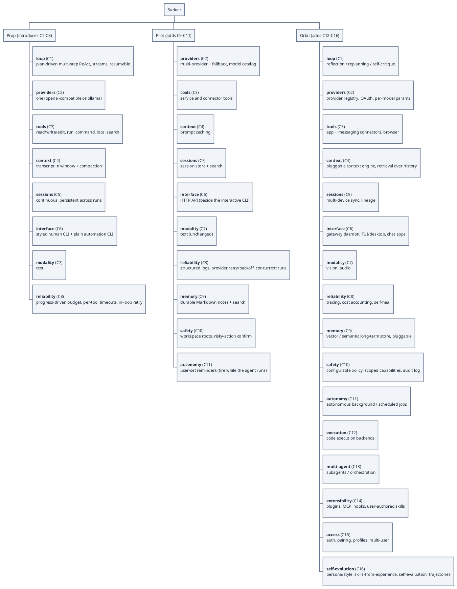
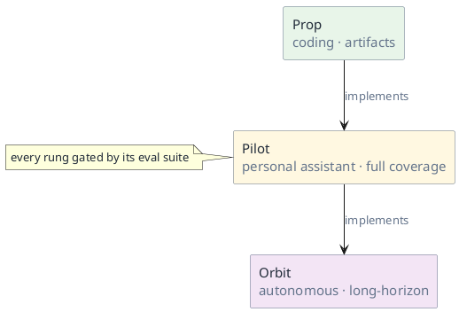

# Architecture

> Status: draft · Version 0.6 · **Current tier: Prop**

Every agent, at its core, is one loop. Everything else is scope built
around that loop.

## The core loop

A goal is one user request; a run is one execution of this loop over it.
The model ends a run by choosing a `finish` action that produces the
answer — a clarifying question to the user counts as a finish, and the
reply arrives as a new goal. Otherwise it keeps calling tools until the run
stalls, hits the step ceiling, or is blocked. Tool errors surface as
observations and are retried within the loop (each retry counts toward the
stall budget unless it makes progress); a policy denial or an unrecoverable
error marks the run blocked. If the run stalls or hits the ceiling first, it
still answers — best-effort, marked incomplete — rather than aborting
silently.

The loop is what every tier shares. A tier is defined by the *work it is
for*, not by the components it is built from: `Prop` is for coding (turning
instructions into working artifacts and tool actions), `Pilot` extends it to
cover everyday personal tasks end-to-end, and `Orbit` extends `Pilot` to run
long, multi-step work autonomously. Each tier is a superset of the one below,
so the same loop runs everywhere; what changes is how far it is expected to
carry a task — a plan-driven interactive loop at `Prop` that streams and can
drive both a styled human CLI and a plain automation surface, reflection and
replanning at `Orbit`; session continuity at `Prop` versus durable recall at
`Pilot`; on-demand use versus autonomous long-horizon work.

## LLM capability boundary

The loop has exactly one model touchpoint: *decide the next action*. The
division of labor is that **the model maps ambiguity to structure, and
everything deterministic is enforced outside it**. Read this way, each
component exists either to feed the model context or to backstop a weakness
it cannot carry — the boundary below doubles as a completeness check on the
component map.

Within sudoer's scope, the model is good at:

- **Ambiguity → structure** — turning goal plus observations into the next
  tool call or `finish`, and intent into typed arguments (C1, C3,
  [schemas.md](schemas.md)).
- **Producing artifacts** — code, prose, summaries, clarifying questions;
  generation with fast feedback is its best case, which is the whole of
  `Prop`'s deliverable.
- **Local reasoning over given context** — interpreting an error
  observation, choosing a retry or an alternate route, small replans
  (C1, C8).
- **Compression and selection** — compaction (C4), relevance judgments for
  retrieval (C9), best-effort answers.

And not good at — each weakness carried by scaffolding, not by the model:

| Model weakness | What carries it |
| --- | --- |
| Determinism and precision (arithmetic, exact strings, verbatim recall) | tools guarantee exactness — edit string-match, `run_command`; never in-context |
| State and time (cross-run memory, waking unprompted) | sessions (C5), compaction (C4), memory (C9); reminders (C11) are system-fired, the model only reacts |
| Long-horizon discipline (drift, goal loss) | step ceiling, stall budget, the plan-driven loop; reflection and replanning only at `Orbit` |
| Knowing when to stop (calibration) | termination belongs to the loop — stall or ceiling still answers, marked incomplete |
| Trust and safety judgment | guards and policy (C10) are code, not prompts; a denial blocks the run |
| Reproducibility (same input, different output) | build gates run against a deterministic provider |
| Cost per decision (tokens, latency) | prompt caching (Pilot), the plain automation surface; never ask the model what a script can decide |

The build ladder therefore runs *against* model-native strength. Coding
(`Prop`) is verifiable — feedback is cheap and deterministic — so model plus
tools shine there, which is why coding is the seed. `Pilot`'s everyday tasks
lack a compiler, so deterministic scaffolding (memory, safety) carries more
of the weight. `Orbit` targets the model's weakest axis — the long horizon —
which is why C12–C16 are almost entirely scaffolding around that weakness.
The true edge of what sudoer can promise is the task with no feedback signal
at all — no compiler, no test, no user reply — and that edge bounds
`Pilot`'s "full coverage".

## Tier scope

Three tiers, each a superset of the one below: **Prop → Pilot → Orbit**. A
tier is classified by function — the kind of work it is meant to do — rather
than by the components it happens to contain.

| Tier | Function — what the work is |
| --- | --- |
| **Prop** | Coding. Take an instruction and deliver: follow it strictly, and produce working binary artifacts and tool actions flawlessly. |
| **Pilot** | Personal assistant. Everything Prop does, plus full-coverage support for everyday personal tasks end-to-end. |
| **Orbit** | Autonomy. Everything Pilot does, plus fully autonomous execution of super-long, multi-step tasks. |

Function defines the tier; components implement it. Each tier is a prefix of
the same component list (`C1`–`C16`), so the scopes stack: `Pilot` includes
every `Prop` capability, and the implementation of a higher tier is a
superset of the lower one's.

A tier's scope is its **usage domain, not a capability budget**. `Prop` owns
the coding domain without limit: anything coding requires belongs to `Prop`
and is driven to top-niche quality there, even when the mechanism is one the
component map first names at a higher tier. `Pilot` and `Orbit` do not add
coding power; they add domains — everyday personal tasks, then autonomous
long-horizon work. A lower tier is never forbidden a mechanism its own domain
needs.

Arrows mark newly introduced components (numbered `C1`–`C16` below);
components already present deepen within a tier — at Pilot, `loop`,
`providers`, `tools`, `context`, `sessions`, `interface`, and `reliability`
all strengthen without being new. Each component's detailed design lives in
its own file, named `C<n>_<component>.md` (for example
[C1_loop.md](C1_loop.md)). The Prop tier's components are assembled and
profiled in [agent_prop.md](agent_prop.md), and their interface contracts
are frozen in [schemas.md](schemas.md).

### Detailed breakdown

Components are numbered `C1`–`C16` in order of first introduction: each tier
is a prefix of the same list, so a capability shared by several tiers stays
on one horizon (`loop` is always `C1`, `sessions` always `C5`, and so on).
This component map is the *implementation* view; the tier names and the table
above are the *function* view. Prop enforces a fixed set of built-in guards;
`safety` (`C10`) is where those become configurable policy.

The numbering is therefore an *introduction order*, not a scope fence. When a
mechanism first named at a higher component is required for coding, `Prop`
implements it at `Prop` and holds it to top-niche quality; it does not wait
for that component's tier. The cross-cutting coding mechanisms today are:

| Coding need | Mechanism | Component that first named it | Tier that owns it |
| --- | --- | --- | --- |
| parallel exploration / context isolation | subagents | `C13` multi-agent | Prop |
| dev-tool integration (LSP, linters, debuggers) | MCP client | `C14` extensibility | Prop |
| UI / frontend visual inspection | vision input | `C7` modality | Prop |

Only a mechanism whose purpose is a *higher domain* — personal connectors,
general user-authored plugins, audio, multi-device sync, autonomous
scheduling — is withheld from `Prop`.

## Build ladder

Self-implementation runs *through* the tiers: **Prop implements Pilot,
Pilot implements Orbit**. It is the vertical axis, and the tiers are
its rungs. Prop is produced once by a human-driven bootstrap; every tier
above it is built by the tier below. Orbit, once built, may also modify
itself.

Every rung includes Prop's coding capability — Pilot and Orbit are supersets
of Prop, not different products — so each can work on the codebase. A rung
must pass its build gate before it may build the next: a gate is the tier's
eval suite — a fixed set of tasks the rung must complete, run against a
deterministic provider (scripted model responses) so results are
reproducible offline. This keeps a regression at one rung from silently
corrupting the one above.

The builder need not *possess* the capability it builds: Prop can write
memory or safety code without having memory or safety, just as a bootstrap
compiler compiles features it cannot run itself. What Prop does need is
enough to do real work on the codebase it is generated from — a multi-step
loop, file read/write/edit, `run_command`, and search.

Self-hosting is how the ladder is built, so Prop's envelope is normative.
The seed MUST be able to build and pass the Pilot gate, and MAY rebuild
itself. Envelope limits — budget, timeouts, context, session continuity —
are part of Prop's contract, not preferences; a limit that prevents
self-hosting is a Prop defect, not a lifestyle choice. Prop must therefore
run as a continuous interactive session deep enough to compile and test the
code it writes; it must not be one-shot or memoryless.

## Tier intent

- **Prop** — coding. An interactive agent that follows instructions strictly
  and delivers working binary artifacts and tool actions: a plan-driven
  multi-step loop, file read/write/edit, `run_command`, search, built-in
  `web_search`/`web_fetch`, a continuous session with on-disk continuity,
  and in-window compaction. It is the seed produced by the human-driven
  bootstrap, from which the higher tiers are self-built. It builds and runs
  as a native executable on Linux, macOS, and Windows. No durable
  *semantic* memory, only built-in guards (no configurable policy), no server.
- **Pilot** — personal assistant, full coverage: everything Prop does, plus
  support for everyday personal tasks end-to-end — durable semantic memory, a broader
  service/connector tool set, safety boundaries, context caching,
  multi-provider fallback, and an HTTP surface beside the interactive CLI.
  This is the shipping target.
- **Orbit** — autonomy, long-horizon: everything Pilot does, plus fully
  autonomous execution of super-long multi-step tasks, a distinct style and
  voice, skills grown from experience, connectors, extensibility, access
  control, and multi-agent. Out of scope until Pilot is solid; never faked
  (no stubs or placeholders).

> Scope boundaries are normative, but they bound the *usage domain*, not the
> capability. The implementation MUST NOT implement a usage domain beyond the
> current one — `Prop` must not become a personal assistant (`Pilot`) or an
> autonomous long-horizon scheduler (`Orbit`) — and a tier becomes current
> only when this document is updated to promote it. Within its domain it has
> no ceiling: `Prop` MUST implement any capability coding requires, including
> a mechanism a higher component first names, and drive it to top-niche
> quality. Withholding a coding-required capability from `Prop` is a Prop
> defect, not a scope rule.
