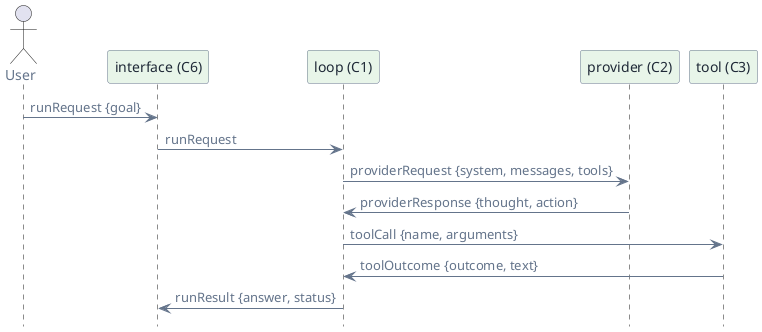

# Prop Schemas

> Status: draft · Version 0.5 · **Current tier: Prop**

These are the frozen interface contracts for the Prop agent
([agent_prop.md](agent_prop.md)). Each component is built against them;
together they are the blueprint the implementation is generated from. The
design is authored here, in the schemas, not in hand-written code.

The machine-readable schemas live in [`agent_prop/`](agent_prop/): each file is
JSON Schema draft 2020-12 and references the others by relative `$id`.

## Files

| File | Defines | Used by |
| --- | --- | --- |
| [config.schema.json](agent_prop/config.schema.json) | the startup configuration object | loaded by `C6`; read by `C2`, `C3`, `C4`, `C5` |
| [run.schema.json](agent_prop/run.schema.json) | `runRequest`, `runResult` | `C1`, `C5`, `C6` |
| [session.schema.json](agent_prop/session.schema.json) | the persisted session file: `planItem`, transcript | `C5`, read by `C1`, `C4` |
| [message.schema.json](agent_prop/message.schema.json) | `action`, transcript `entry` | `C1`, `C4`, `C5` |
| [tool.schema.json](agent_prop/tool.schema.json) | `toolDefinition`, `toolCall`, `toolOutcome` | `C3`, `C2`, `C1` |
| [provider.schema.json](agent_prop/provider.schema.json) | `providerRequest`, `providerResponse` | `C2`, called by `C1` |

The build gate adds its own schemas beside these — `completion.schema.json`,
`script.schema.json`, and `task.schema.json` — described in
[agent_prop/gate.md](agent_prop/gate.md).

## Interface flow

`config` flows from the interface into `C2` and `C3` at startup and does not
appear on the per-step path.

## Invariants

Normative; each is grounded in a component doc.

- **Transcript shape.** A transcript begins with a `userEntry`; an
  `assistantEntry` is followed by its `observationEntry`s, and `C1` appends
  `(thought, action, observations)` each iteration. A *harness* observation —
  a provider timeout or cancel, with no `tool_call_id` — may stand alone
  without a preceding `assistantEntry` and is replayed to the provider as a
  user message (`C2`). The transcript belongs to the session (`C5`), so it
  spans runs. Context (`C4`) pins the current goal and plan and compacts the
  oldest entries into a summary to fit the window; the stored transcript is
  unchanged.
- **Plan.** A session carries a `plan`: a small ordered list of `planItem`.
  A completion may include a `plan`, which replaces it (`C1`). The plan is
  persisted with the session (`C5`). A provider populates `completion.plan`
  from the model's fenced `plan` block (`C2`).
- **Session continuity.** The session transcript and plan are written to a
  session file after each run and can be resumed by id (`C5`).
- **Terminal action.** A `finish` ends the run; a completion with no
  parseable action is returned as a `finish` (`C2`).
- **Tool binding.** A `toolCall.name` must match an advertised
  `toolDefinition`, and its `arguments` must validate against that tool's
  `parameters` (`C3`).
- **Observation binding.** A tool-result observation carries its call's
  `tool_call_id`; harness observations such as a provider timeout carry none
  and are never replayed as tool results (`C2`).
- **Outcome semantics.** `toolOutcome.outcome` of `ok` or `error` is a
  recoverable observation and the loop re-iterates; `guard_denied` blocks
  the run (`C1`, `C8`).
- **Result semantics.** `runResult.status` is `complete`, `incomplete`, or
  `blocked`; `complete` and `incomplete` always carry a string `answer`,
  `blocked` may carry none. `incomplete` marks a best-effort answer after the
  run stalls or hits the step ceiling (`C1`).
- **Closed objects.** Every object sets `additionalProperties: false`
  except the free-form maps `toolCall.arguments` and
  `toolDefinition.parameters`, which are themselves JSON Schema (`C3`).
- **Surfaces and streaming.** The provider call takes an optional delta
  callback so the human surface can stream text; this is a runtime concern,
  so no serialized schema changes. The completion produced by either the
  streamed or the one-shot path is identical (`C2`).
- **Configuration.** Provider settings are read at startup and fixed for the
  process; `workspace_root` defaults to the process working directory and,
  like other session-level, non-policy settings, may change during a session
  via interface commands (`C6`). The budget bounds (stall budget and step
  ceiling) and the per-tool-class timeouts are compiled-in constants and are
  deliberately absent from `config` (`C8`).

## Freezing

These schemas are frozen for Prop. Changing one is a blueprint change:
update the owning component doc, bump this document's version, and only
then regenerate code. Pilot adds schemas beside these (`C9`–`C11`);
Prop's must not grow to anticipate them.
