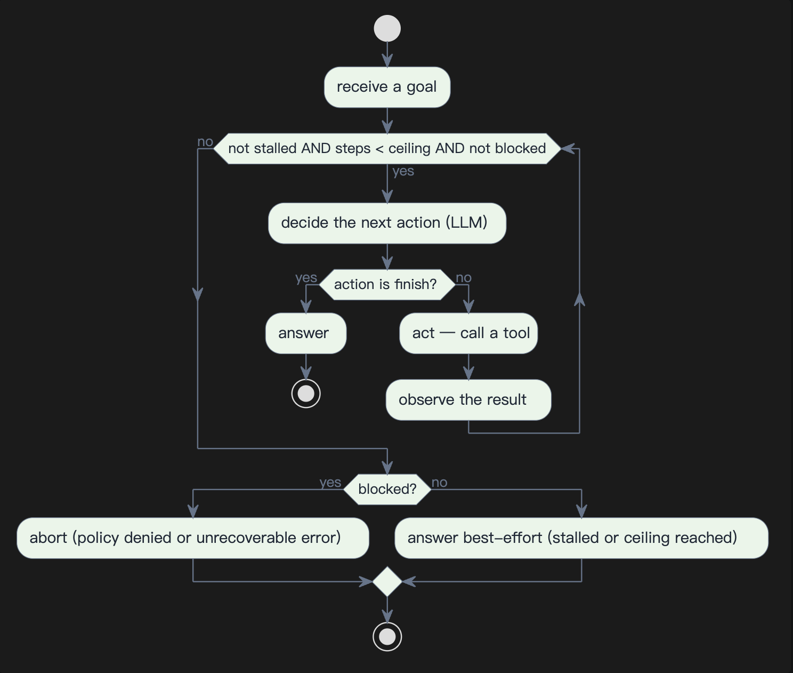

#  Sudoer: Blueprint-Driven AI Agents

> *"Not knowing a horse’s genome won't throw you from the saddle; not knowing your harness will."*

**Sudoer** is a design-first, blueprint-driven, self-evolving family of local AI agents. It shifts the paradigm from writing brittle runtime code to configuring deterministic engineering mechanisms. 

Every single behavior in Sudoer is fully traceable to a human-authored blueprint, making it readable, understandable, and modifiable by anyone. Sudoer runs entirely on local hardware under your absolute control. Pair it with any remote LLM endpoint or a local LLM runner (such as Ollama) for complete, air-gapped privacy.



> **Viewing the diagrams** — every diagram in this repository is authored in [PlantUML](https://plantuml.com) (the fenced `plantuml` blocks throughout [`00_bp/`](00_bp/)). GitHub renders them as plain code blocks; to view them rendered, open the docs in VS Code with the [PlantUML Local](https://marketplace.visualstudio.com/items?itemName=kkdev92.plantuml-local) extension (local rendering — no diagram ever leaves your machine).

---

## Highlights

* **Blueprint-Driven Architecture**
  * Focuses strictly on blueprint and schema design rather than manual code implementation.
  * Driven by deterministic state mechanisms rather than volatile prompt engineering.
  * Legible and transparent for software developers and non-technical stakeholders alike.
* **Tiered Agent Ecosystem**
  * **Prop:** A precision-engineered coding seed designed to handle deterministic tool actions.
  * **Pilot:** A thoughtful, end-to-end assistant built to secure and automate your personal workflows.
  * **Orbit:** An autonomous digital voyager optimized for long-horizon, multi-step missions.
* **Self-Evolving Lifecycle**
  * Bootstrap the foundational **Prop** engine.
  * **Prop** autonomously generates and compiles **Pilot**.
  * **Pilot** scales up, automates, and deploys **Orbit**.

---

## Agent Tiers & Target Metrics

Sudoer agents deploy in cumulative tiers, where each higher tier completely inherits and expands upon the operational capabilities of the last:

| Agent | Focus Area | Platform | Status |
| :--- | :--- | :--- | :--- |
| **Prop** | Tool Execution & Engineering | Windows <br> Linux <br> macOS | ✅ Ready <br> ✅ Ready <br> ✅ Ready |
| **Pilot** | Privacy & Personal Automation | Windows <br> Linux <br> macOS | 🛠️ In Progress <br> 🛠️ In Progress <br> 🛠️ In Progress |
| **Orbit** | Long-Horizon Autonomy | Windows <br> Linux <br> macOS | 📋 Roadmap <br> 📋 Roadmap <br> 📋 Roadmap |

* **Prop: The Coding Seed** — Interprets raw structural instructions strictly to deliver working binary artifacts and tool actions. This is the foundational seed that compiles the higher tiers of the ecosystem.
  * *Build Path:* Compiled from the core blueprint (`00_bp/`) combined with hardcoded bootstrap implementations.
* **Pilot: The Personal Assistant** — Inherits all tool capabilities of Prop, introducing secure, end-to-end orchestration of everyday personal data workflows within local privacy boundaries.
  * *Build Path:* Automatically generated and implemented by **Prop** using the system blueprint.
* **Orbit: The Autonomous Voyager** — Inherits all automation capabilities of Pilot, unlocking fully autonomous, long-horizon task execution across complex web, mobile, and desktop software ecosystems.
  * *Build Path:* Automatically generated and implemented by **Prop** using the system blueprint.


---

## Getting Started

1. Download the target agent executable for your system from the [Latest Release](https://github.com/invented-pro/sudoer/releases/latest) page.

   > **Note — unsigned binaries:** Release executables are not code-signed yet, and the `.zip` archives do not preserve the executable bit.
   >
   > * **Linux / macOS:** after extracting, restore the executable permission:
   >
   >   ```bash
   >   chmod +x sudoer-prop
   >   ```
   >
   > * **macOS only:** Gatekeeper may additionally block the binary with a *"developer cannot be verified"* warning. Either strip the quarantine attribute:
   >
   >   ```bash
   >   xattr -d com.apple.quarantine sudoer-prop
   >   ```
   >
   >   or attempt one launch, then approve it via **System Settings → Privacy & Security → Open Anyway**.
   >
   > * **Windows:** if SmartScreen shows *"Windows protected your PC"*, choose **More info → Run anyway**. To clear the flag beforehand, right-click `sudoer-prop.exe` → **Properties → Unblock**, or run in PowerShell:
   >
   >   ```powershell
   >   Unblock-File .\sudoer-prop.exe
   >   ```

2. Configure your local or remote LLM environment.
3. Create a `sudoer.json` configuration file in the same directory as the agent executable:

```json
{
  "provider": {
    "kind": "openai-compatible",
    "base_url": "https://api.llm.com/v1",
    "api_key": "your-api-key-here",
    "model": "your-model-name",
    "context_window": 1000000
  },
  "web": {
    "search_url": "https://ws.sudo8.com"
  }
}
```

### Execution Modes

#### **Prop**  
The **Prop** agent compiles as a standalone single binary executable that functions in two distinct runtime modes:
* **Interactive CLI Mode:** An interactive, terminal-based user environment designed for direct coding tasks and code pairing.
* **Automate Mode:** Activated with the `--automate` flag. This runs unattended batching scripts to execute the autonomous compilation and implementation routines for **Pilot** and **Orbit**.

#### **Pilot**
*In-progress*

#### **Orbit**
*Roadmap*

---

## Community

* **Discussions:** [GitHub Discussions](https://github.com/invented-pro/sudoer/discussions)
* **Contributing:** pull requests are welcome. First-time contributors sign the [CLA](./CLA.md) once with a single PR comment.

---

## Contributors

Thanks to everyone who contributes to Sudoer — code, blueprints, docs, and ideas all count.

<!-- ALL-CONTRIBUTORS-LIST:START - Do not remove or modify this section -->
<!-- prettier-ignore-start -->
<!-- markdownlint-disable -->
*(contributor list — populated as the first contributions land)*
<!-- markdownlint-restore -->
<!-- prettier-ignore-end -->
<!-- ALL-CONTRIBUTORS-LIST:END -->

Want to join them? Start here:

### Repository Layout

The Sudoer repository functions as a unidirectional engineering pipeline. Source code lives exclusively within the `10_impl/` directory:

```text
├── 00_bp/       # Language-agnostic blueprints: architectures, schemas, and frozen system interfaces.
├── 10_impl/     # Executable implementations automatically generated from the blueprints.
├── 20_eval/     # Active runtime testing environments, live configurations, and agent sessions.
└── 90_dist/     # Deployment pipelines, compilers, and production packaging artifacts.
```

### Workflow: Blueprint First

This is a blueprint-driven project, but the blueprint is not magic: at the current **Prop** stage two surfaces are managed by hand.

- `00_bp/` — the language-agnostic blueprint: architecture, component docs, and the frozen wire schemas. The source of truth.
- `10_impl/agent_prop/` — the hand-authored Prop seed that realizes the blueprint. It is not only Dart code: it also holds the initial/system prompts and the activation and build scripts.

Always, in order:

1. **Blueprint first.** Change the rule in `00_bp/` (and the schemas in `00_bp/agent_prop/` if the wire shape changes) before touching code. If a change has no blueprint home, add or amend the owning component doc and bump its version.
2. **Then implement.** Make `10_impl/agent_prop/` a consequence of the amended blueprint, editing its code, prompts, and scripts by hand. The implementation only covers Prop (C1–C8); never add Pilot/Orbit behavior here.
3. **Then test.** Add or update tests, then run the build and verification in [`10_impl/AGENTS.md`](10_impl/AGENTS.md).

Higher tiers are *not* hand-written. Once Prop can self-host, the intent is that Prop generates and implements Pilot, and Pilot generates Orbit, so their code becomes a downstream consequence of the blueprint — fix the structural rule there rather than editing generated output by hand.


---

## License

This project is licensed under the terms of the **PolyForm Noncommercial 1.0.0** license (`PolyForm-Noncommercial-1.0.0`). Free for personal, research, and other noncommercial use. Commercial use requires a separate license from [sudo8.com](mailto:hi@sudo8.com). For full details, see the [`LICENSE`](./LICENSE) file in the repository root.
